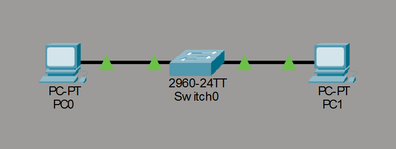
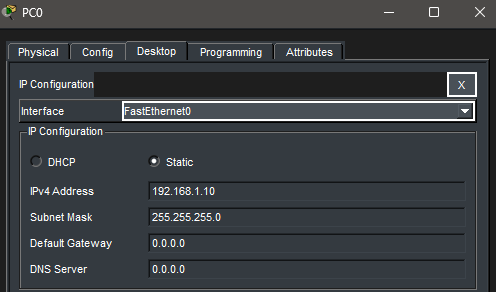
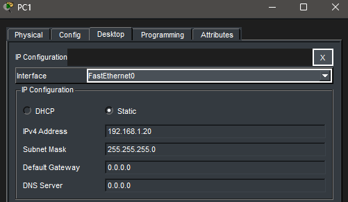
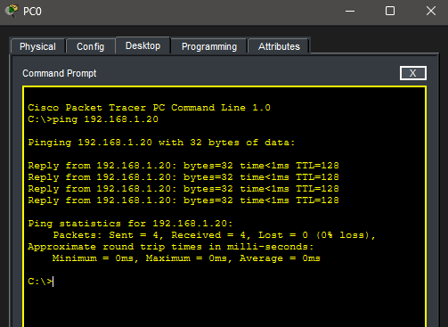

# Lab 01 – Basic Network Connectivity

## Objective
Build a simple Local Area Network (LAN) using a switch and verify connectivity between two devices using IPv4 addressing and ICMP (ping).

## Topology
2 PCs (PC0, PC1) connected to a single switch.

## IP Configuration
- **PC0:** 192.168.1.10 / 255.255.255.0  
- **PC1:** 192.168.1.20 / 255.255.255.0

  

## Verification
- From PC0, ping 192.168.1.20
- Successful ping confirms connectivity

## Key Takeaways
- Devices must be in the same subnet to communicate
- Switches allow devices in the same network to communicate
- Ping is a basic but powerful troubleshooting tool

> Note: Connectivity will fail if devices are in different subnets, which will be explored in later labs.
