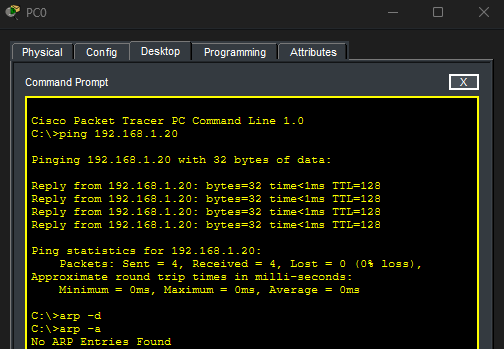
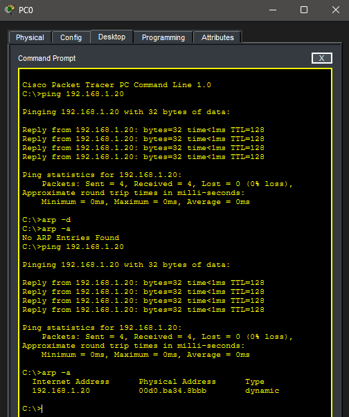
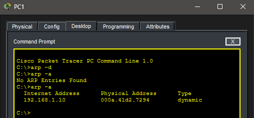

# Lab 1.5 – Mini ARP Lab

## Objective
Observe ARP behavior and understand how devices map IP addresses to MAC addresses.

## Topology
Two PCs connected to a switch:

## Steps Performed
1. Cleared ARP tables on both PCs (`arp -d`)
2. Pinged PC1 from PC0
3. Checked ARP tables on both PCs

## ARP Tables

### PC0
Before ping:  
  

After ping:  
  

### PC1
After ping:  
  

## Key Takeaways
- ARP maps IP addresses to MAC addresses for local communication
- Ping triggers ARP requests if MAC is unknown
- ARP tables are stored temporarily and updated dynamically
- Simulation mode can show ARP requests/replies visually
