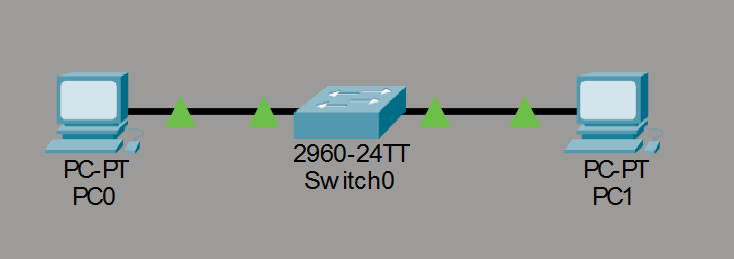
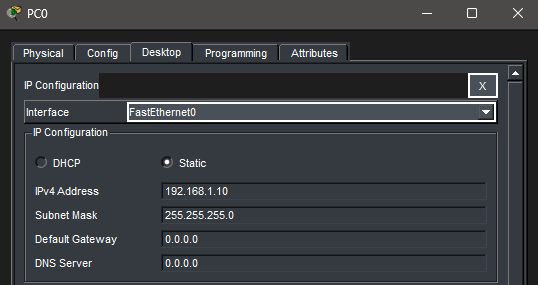
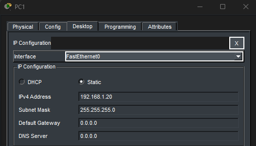
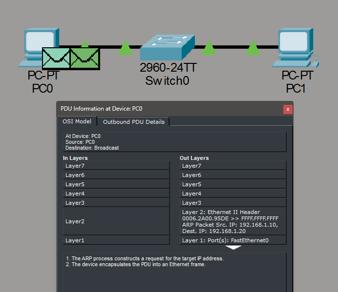
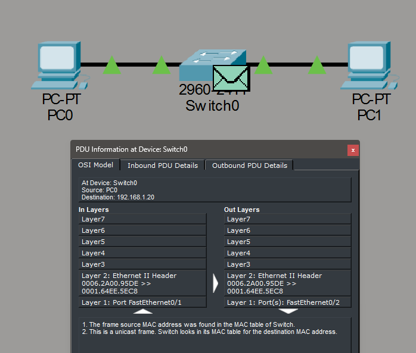
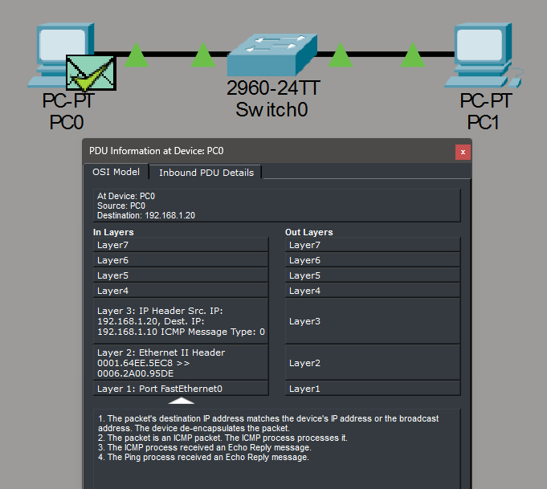
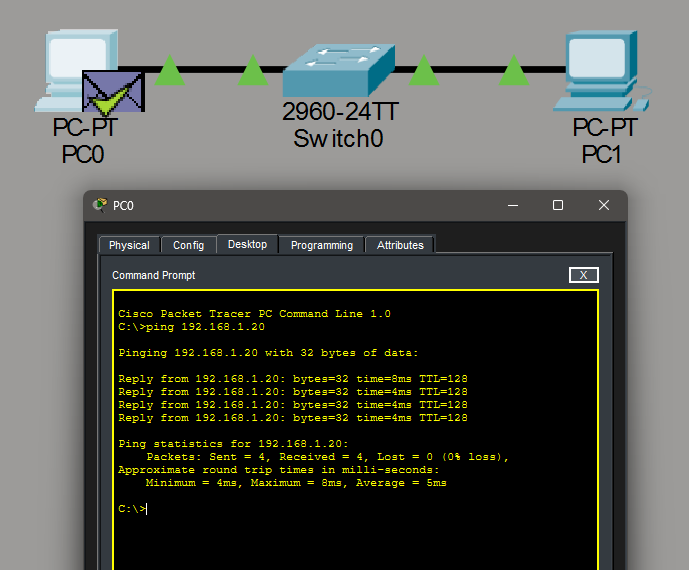

# Lab 2 – OSI Model & Packet Flow

## Objective

Visualize how data travels between two devices using the OSI model and observe how packets are encapsulated and decapsulated during communication.

---

## Topology

Two PCs (PC0 and PC1) connected to a single switch.

---

## IP Configuration

* **PC0:** 192.168.1.10 / 255.255.255.0
* **PC1:** 192.168.1.20 / 255.255.255.0

---

## Steps Performed

1. Configured IP addresses on both PCs
2. Verified connectivity using the `ping` command
3. Switched to Simulation Mode in Packet Tracer
4. Filtered traffic to display ARP and ICMP protocols
5. Stepped through packet flow to observe OSI layer interactions

---

## Simulation Observations

### ARP Resolution

Before ICMP communication can occur, PC0 must resolve the MAC address of PC1.

* PC0 sends an ARP request asking for the MAC address of 192.168.1.20
* PC1 responds with its MAC address
* This enables Layer 2 communication

---

### ICMP Echo Request

PC0 sends an ICMP Echo Request to PC1 after ARP resolution is complete.

* Layer 4: ICMP Echo Request
* Layer 3: Source IP (PC0) → Destination IP (PC1)
* Layer 2: Source MAC → Destination MAC

---

### ICMP Echo Reply

PC1 responds with an ICMP Echo Reply back to PC0.

* Layer 4: ICMP Echo Reply
* Layer 3: Source IP (PC1) → Destination IP (PC0)
* Layer 2: Source MAC → Destination MAC

---

## Verification

Connectivity was confirmed using a successful ping from PC0 to PC1.

---

## Key Takeaways

* ARP is required to map IP addresses to MAC addresses before communication
* ICMP operates at Layer 3 and is used for connectivity testing
* Data is encapsulated as it moves down the OSI layers and decapsulated on receipt
* Switches forward frames based on MAC addresses (Layer 2)
* Simulation Mode provides a clear visualization of packet flow and OSI layer interaction

---

## Tools Used

* Cisco Packet Tracer

---

## Summary

This lab demonstrates how devices communicate across a network using multiple layers of the OSI model. By observing ARP and ICMP traffic in Simulation Mode, the process of encapsulation and packet delivery becomes clear and easier to understand.

