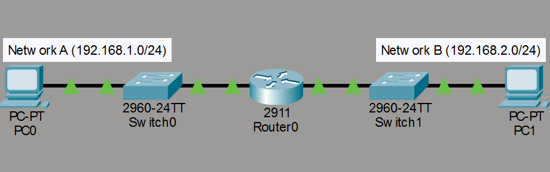
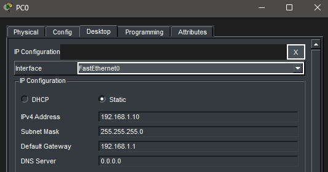
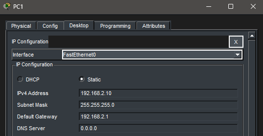
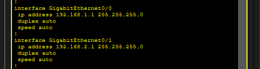
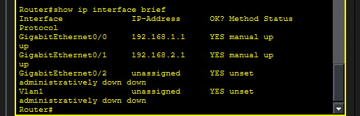
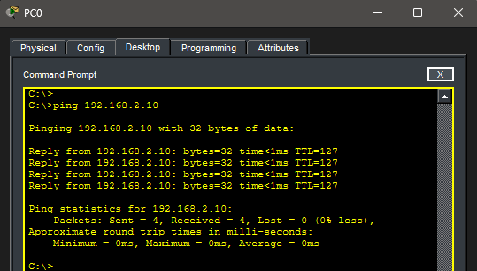

# Lab 3 – Subnetting & Inter-Network Communication

## Objective

Demonstrate communication between devices on different networks using a router and verify connectivity using structured troubleshooting.

---

## Topology

Two separate networks connected by a router:

---

## Network Configuration

### Network A

* **PC0:** 192.168.1.10 /24
* **Default Gateway:** 192.168.1.1

### Network B

* **PC1:** 192.168.2.10 /24
* **Default Gateway:** 192.168.2.1

---

## Router Configuration

The router was configured with two interfaces to connect both networks:

---

## Interface Verification

Router interfaces were verified using the `show ip interface brief` command:

* Both interfaces show **up/up**, indicating they are operational

---

## Troubleshooting Steps

1. **Local Connectivity Test**

   * PC0 successfully pinged its default gateway (192.168.1.1)

2. **Router to Remote Network Test**

   * Router successfully pinged PC1 (192.168.2.10)

3. **End-to-End Connectivity Test**

   * PC0 successfully pinged PC1 (192.168.2.10)

---

## Verification

Successful end-to-end communication:

---

## Key Takeaways

* Devices on different networks require a router to communicate
* The default gateway enables communication outside the local network
* Routers operate at Layer 3 using IP addresses
* Interface status must be **up/up** for proper operation
* Structured troubleshooting helps isolate network issues efficiently

---

## Summary

This lab demonstrates how routing enables communication between separate networks and introduces fundamental troubleshooting techniques used in real-world networking environments.

