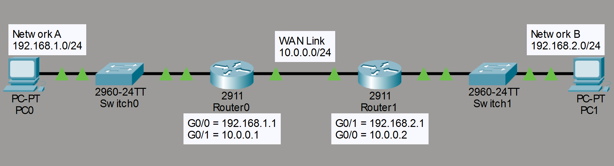
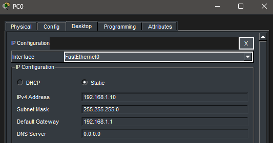
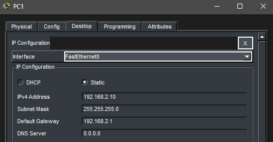
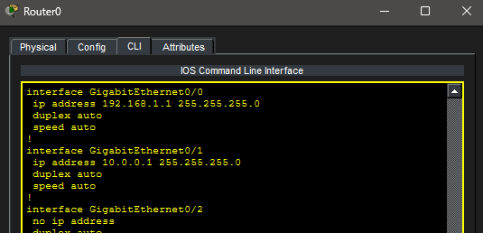
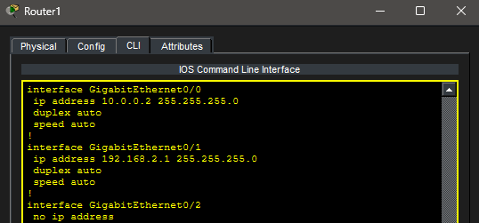
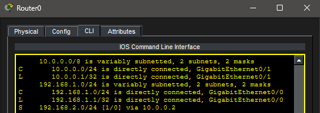
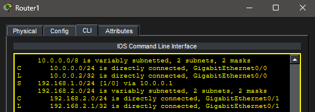
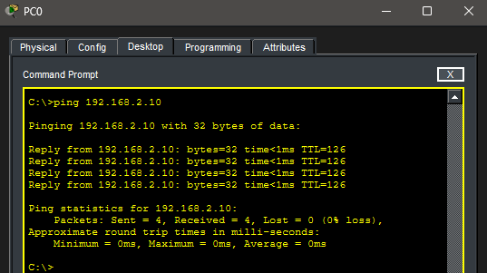

# Lab 4 – Static Routing (Multi-Router Network)

## Objective

Demonstrate communication between multiple networks using static routing across two routers.

---

## Topology

A multi-router network connecting two LANs:

---

## Network Configuration

### Network A

* **PC0:** 192.168.1.10 /24
* **Default Gateway:** 192.168.1.1

### Inter-Router Network

* **R0:** 10.0.0.1
* **R1:** 10.0.0.2

### Network B

* **PC1:** 192.168.2.10 /24
* **Default Gateway:** 192.168.2.1

---

## Router Configuration

### Router R0

### Router R1

---

## Static Routing Configuration

Static routes were configured to enable communication between the two networks:

* R0 routes traffic to Network B via R1
* R1 routes traffic to Network A via R0

---

## Routing Table Verification

### R0 Routing Table

### R1 Routing Table

---

## Troubleshooting Steps

1. **Local Connectivity**

   * PC0 successfully pinged its default gateway (192.168.1.1)

2. **Inter-Router Connectivity**

   * R0 successfully pinged R1 (10.0.0.2)

3. **Routing Verification**

   * Static routes confirmed in routing tables on both routers

4. **End-to-End Connectivity**

   * PC0 successfully pinged PC1 (192.168.2.10)

---

## Verification

Successful communication between PC0 and PC1:

---

## Key Takeaways

* Static routes manually define how routers reach remote networks
* Routers only know directly connected networks by default
* Routing tables determine packet forwarding decisions
* Multi-router networks require explicit route configuration
* Structured troubleshooting is essential in networking

---

## Summary

This lab demonstrates how static routing enables communication across multiple routers and reinforces foundational concepts used in real-world network environments.

