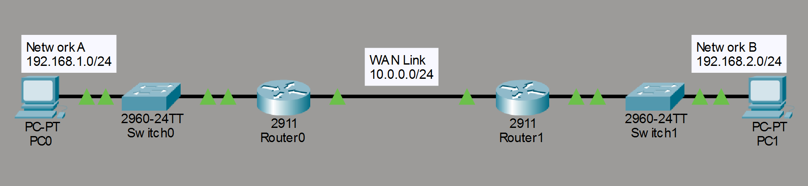
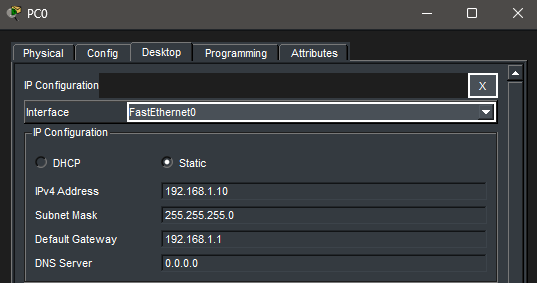
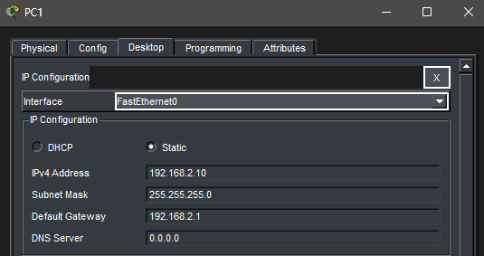
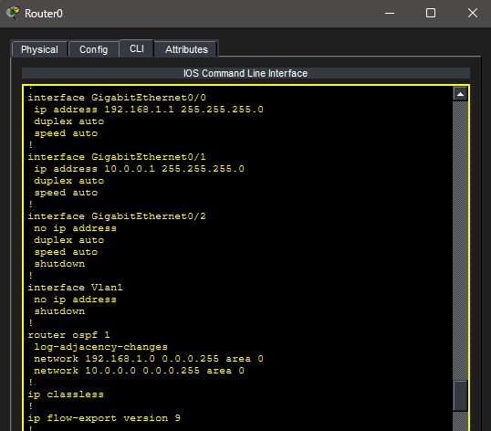
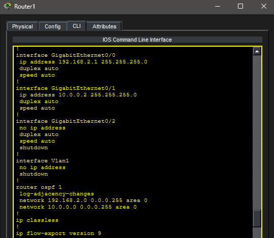
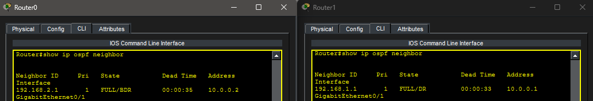
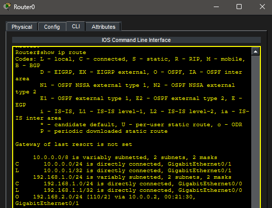
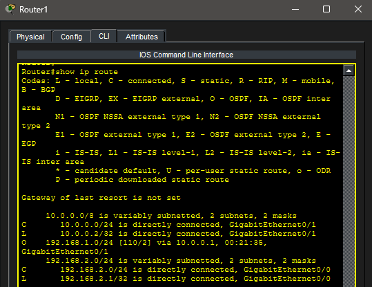
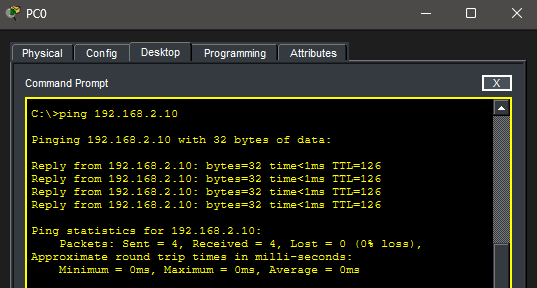

# Lab 5 – Dynamic Routing with OSPF

## Objective

Configure OSPF (Open Shortest Path First) to enable dynamic routing between networks and replace static routing.

---

## Topology

A mirrored multi-router network using dynamic routing:

---

## Network Configuration

### Network A

* **PC0:** 192.168.1.10 /24
* **Default Gateway:** 192.168.1.1

### WAN Network

* **R0:** 10.0.0.1
* **R1:** 10.0.0.2

### Network B

* **PC1:** 192.168.2.10 /24
* **Default Gateway:** 192.168.2.1

---

## Router Configuration

### Router R0

* G0/0 configured for LAN (192.168.1.1)
* G0/1 configured for WAN (10.0.0.1)
* OSPF enabled for both networks

---

### Router R1

* G0/0 configured for LAN (192.168.2.1)
* G0/1 configured for WAN (10.0.0.2)
* OSPF enabled for both networks

---

## OSPF Configuration

* OSPF process ID 1 used on both routers
* Area 0 configured as the backbone area
* LAN and WAN networks advertised using OSPF

---

## OSPF Neighbor Verification

* Routers successfully formed a neighbor relationship
* Adjacency reached FULL state

---

## Routing Table Verification

### R0 Routing Table

### R1 Routing Table

* Routes are dynamically learned via OSPF (denoted by "O")

---

## Troubleshooting Steps

1. Verified all interfaces were up/up
2. Confirmed no static routes were present
3. Verified OSPF neighbor adjacency
4. Checked routing tables for learned routes
5. Tested end-to-end connectivity

---

## Verification

Successful communication between PC0 and PC1:

---

## Key Takeaways

* OSPF dynamically shares routing information between routers
* WAN interfaces are critical for neighbor formation
* Routing tables update automatically without manual configuration
* OSPF uses cost to determine the best path
* Dynamic routing scales efficiently for larger networks

---

## Summary

This lab demonstrates how OSPF enables routers to automatically discover and share network routes, eliminating the need for static routing and introducing scalable network design.

