# Lab 6 – Multi-Router OSPF

## Objective
Configure OSPF across a three-router network and verify dynamic route learning, neighbor relationships, and end-to-end connectivity.

---

## Topology
This lab uses three routers connected in a triangle topology with two LANs.

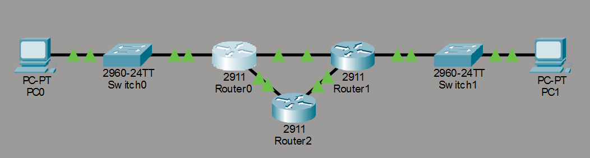

---

## Network Configuration

### Network A
- **PC0:** 192.168.1.10 /24
- **Default Gateway:** 192.168.1.1
- **R0 G0/0:** 192.168.1.1 /24

### Network B
- **PC1:** 192.168.2.10 /24
- **Default Gateway:** 192.168.2.1
- **R1 G0/0:** 192.168.2.1 /24

### WAN Links
- **R0 G0/1 ↔ R1 G0/1:** 10.0.0.0/30
- **R0 G0/2 ↔ R2 G0/1:** 10.0.0.4/30
- **R1 G0/2 ↔ R2 G0/2:** 10.0.0.8/30

---

## PC Configuration

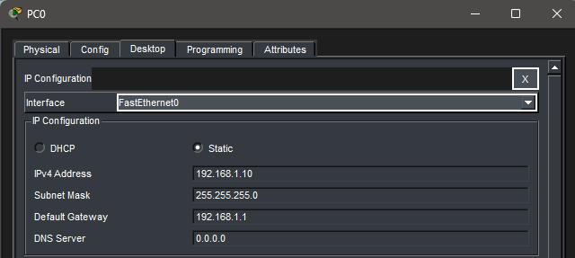

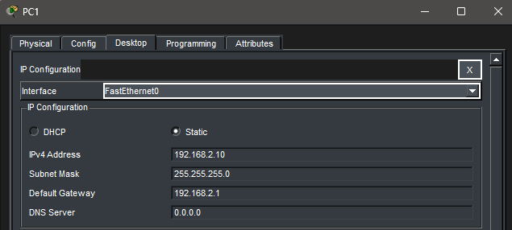

---

## Interface Verification

### R0 Interface Status
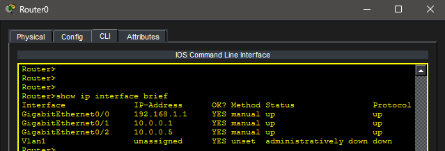

### R1 Interface Status
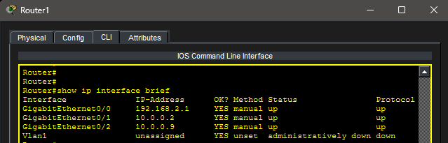

### R2 Interface Status
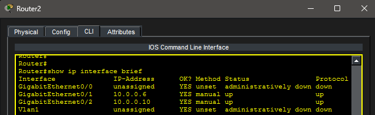

---

## OSPF Configuration

### R0 OSPF Configuration
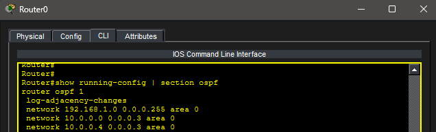

### R1 OSPF Configuration
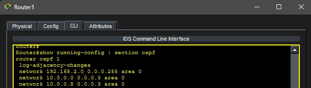

### R2 OSPF Configuration
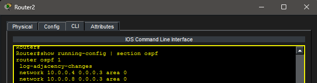

---

## OSPF Neighbor Verification

### R0 OSPF Neighbors
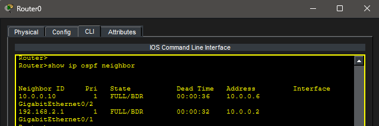

### R1 OSPF Neighbors
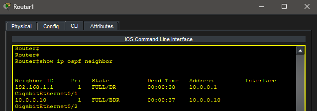

### R2 OSPF Neighbors
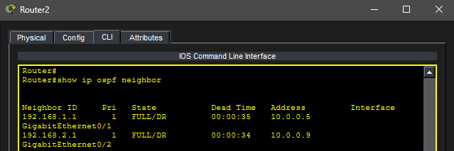

---

## Routing Table Verification

### R0 Routing Table
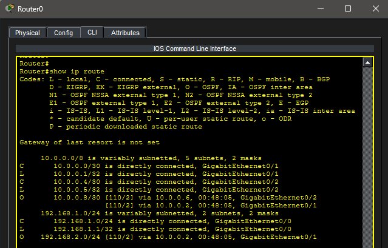

### R1 Routing Table
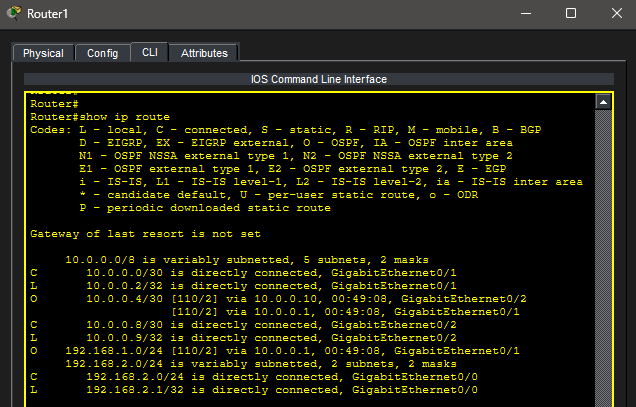

### R2 Routing Table
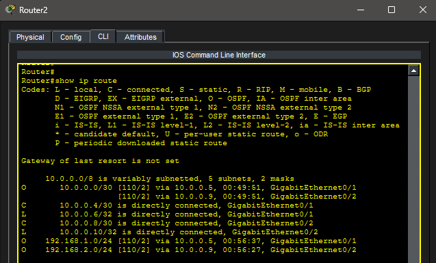

---

## Verification
End-to-end connectivity was verified by pinging PC1 from PC0.

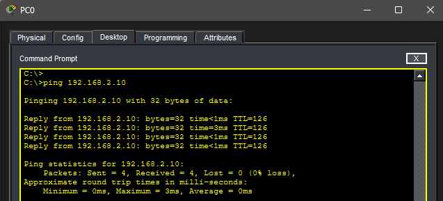

---

## Key Takeaways
- OSPF allows routers to dynamically learn routes from neighboring routers
- Area 0 is the backbone area used in this single-area OSPF lab
- Wildcard masks identify which interfaces participate in OSPF
- `/30` networks are commonly used for point-to-point router links
- OSPF neighbor relationships can be verified with `show ip ospf neighbor`
- OSPF-learned routes appear in the routing table with an `O`

---

## Summary
This lab demonstrates OSPF operating across multiple routers. Unlike static routing, OSPF allows routers to exchange network information dynamically and update routing tables automatically.
