# Lab 7 – OSPF Failover & Convergence

## Objective

Demonstrate OSPF route convergence by intentionally failing a WAN link and observing how OSPF automatically recalculates routes and restores connectivity through an alternate path.

---

## Topology

Three routers connected in a triangle topology with OSPF running on all router links.

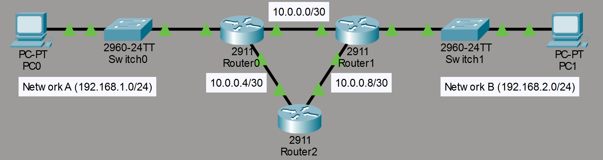

---

## Network Configuration

### Network A

- PC0: 192.168.1.10 /24
- Default Gateway: 192.168.1.1

### Network B

- PC1: 192.168.2.10 /24
- Default Gateway: 192.168.2.1

### WAN Networks

- R0 ↔ R1: 10.0.0.0/30
- R0 ↔ R2: 10.0.0.4/30
- R1 ↔ R2: 10.0.0.8/30

---

## PC Configuration

### PC0

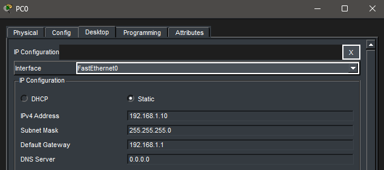

### PC1

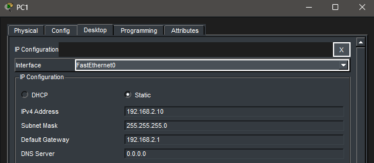

---

## OSPF Neighbor Relationships Before Failure

### R0

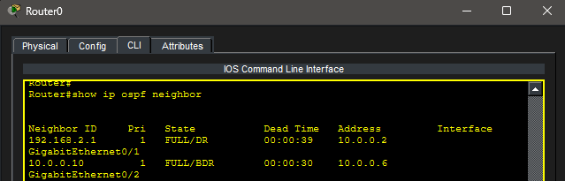

### R1

### R2

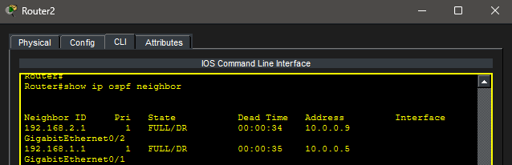

---

## Routing Tables Before Failure

### R0

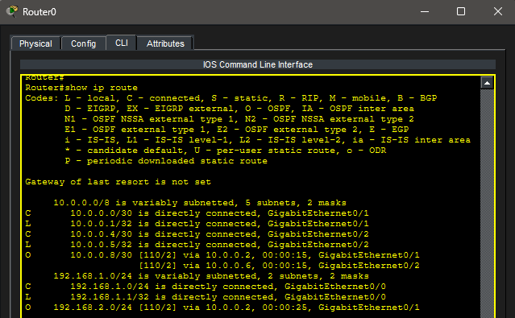

### R1

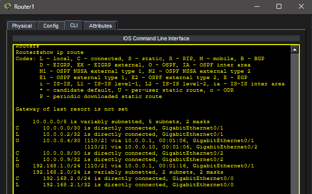

### R2

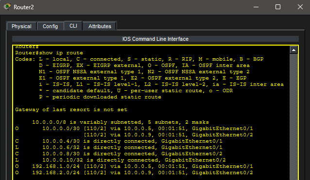

---

## Simulating a WAN Link Failure

The direct WAN connection between R0 and R1 was intentionally disabled.

### Link Failure Configuration

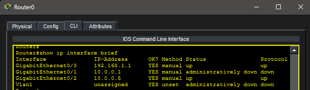

---

## OSPF Neighbor Relationships After Failure

### R0

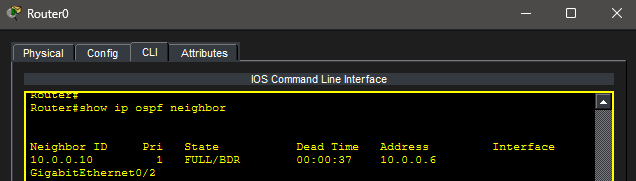

### R1

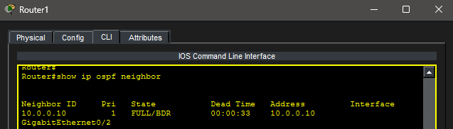

### R2

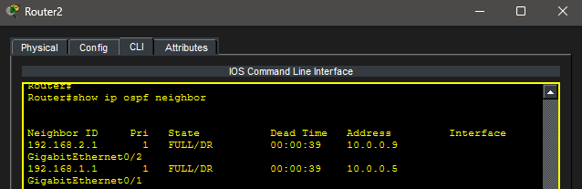

---

## Routing Tables After Failure

### R0

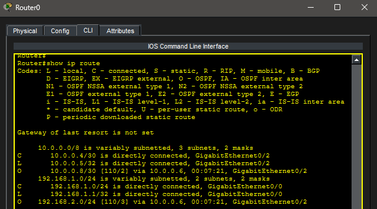

### R1

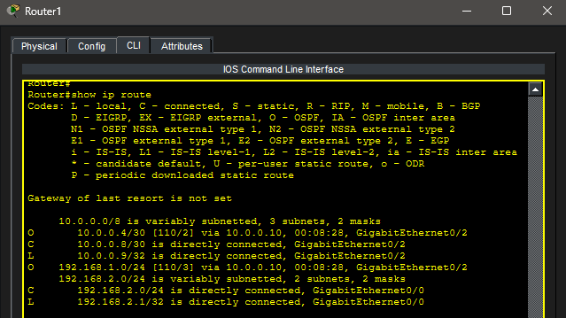

### R2

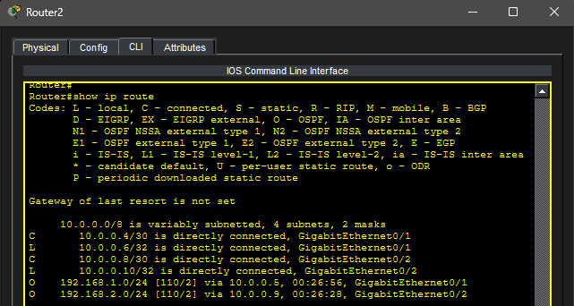

---

## Connectivity Verification

Even after the primary WAN link failed, OSPF successfully recalculated routes and maintained connectivity through the alternate path.

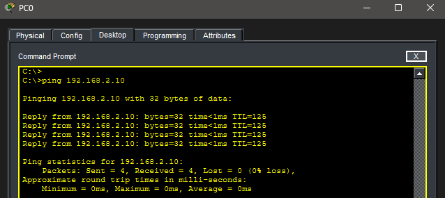

---

## Link Restoration

The failed WAN link was restored and OSPF re-established normal neighbor relationships.

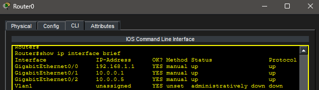

---

## Key Takeaways

- OSPF dynamically adapts to topology changes
- Multiple paths provide network redundancy
- OSPF recalculates routes automatically during failures
- Route convergence allows communication to continue after outages
- Dynamic routing protocols reduce administrative overhead compared to static routes

---

## Summary

This lab demonstrated OSPF convergence and failover behavior in a multi-router environment. By intentionally failing a WAN connection, OSPF automatically selected an alternate path and restored connectivity without requiring manual route changes.
