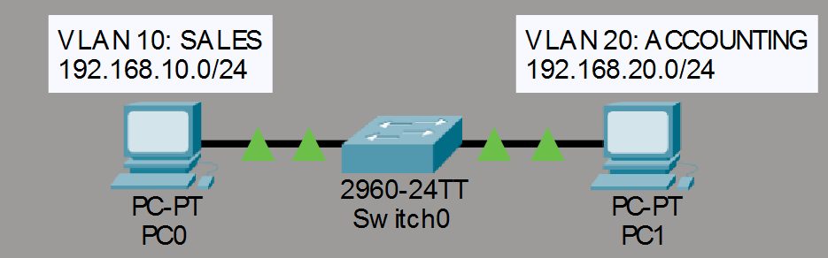
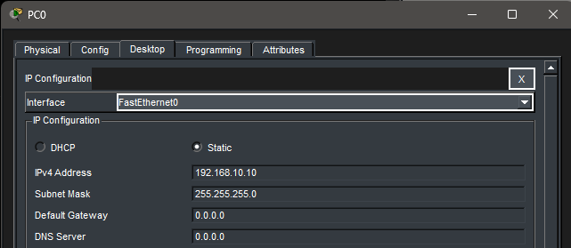
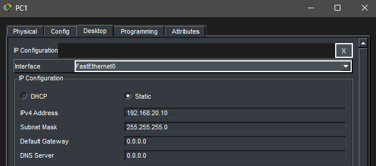
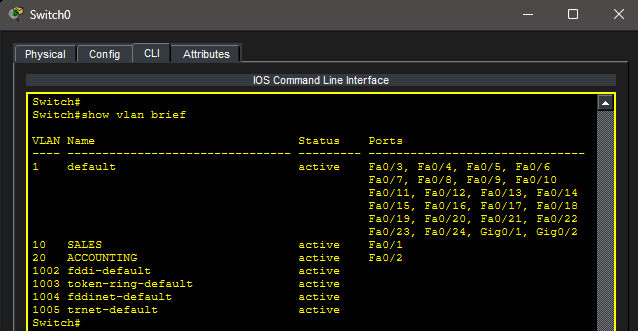
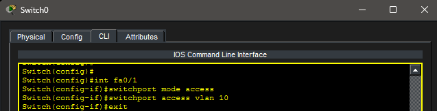
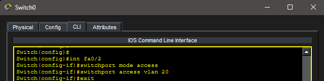
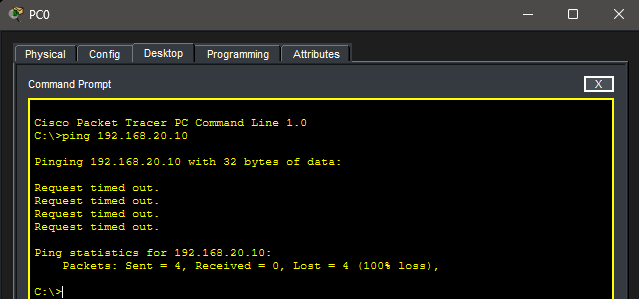

# Lab 8 – VLAN Fundamentals

## Objective

Learn how VLANs logically separate devices into different networks using a switch. Create VLANs, assign switch ports to VLANs, and observe how devices in different VLANs cannot communicate without additional configuration.

---

## Topology

A single switch was used to separate two PCs into different VLANs.

---

## Network Configuration

### VLAN 10 – SALES

- Network: 192.168.10.0/24
- PC0: 192.168.10.10

### VLAN 20 – ACCOUNTING

- Network: 192.168.20.0/24
- PC1: 192.168.20.10

---

## PC Configuration

### PC0

### PC1

---

## Creating VLANs

Two VLANs were created on the switch:

- VLAN 10 – SALES
- VLAN 20 – ACCOUNTING

### VLAN Configuration Verification

---

## Assigning Ports to VLANs

### VLAN 10 Configuration

Fa0/1 was assigned to VLAN 10.

---

### VLAN 20 Configuration

Fa0/2 was assigned to VLAN 20.

---

## Connectivity Test

A ping was attempted from PC0 to PC1.

Because the devices were placed in different VLANs and different IP networks, communication failed.

### Failed Ping

---

## Key Takeaways

- VLANs logically separate devices on the same physical switch.
- Devices in different VLANs belong to different broadcast domains.
- VLANs improve network organization and security.
- Communication between VLANs requires Layer 3 routing.
- VLANs allow multiple networks to exist on the same switch infrastructure.

---

## Summary

This lab introduced VLAN fundamentals by creating two VLANs and assigning switch ports to each VLAN. Devices connected to different VLANs were unable to communicate, demonstrating how VLANs segment a network and create separate broadcast domains.
