# Lab 9 – VLAN Trunking

## Objective

Learn how VLAN traffic is carried between switches using trunk ports. Configure VLANs on multiple switches, establish a trunk connection, and verify communication between devices in the same VLAN across different switches.

---

## Topology

Two switches connected by a trunk link carrying VLAN traffic.

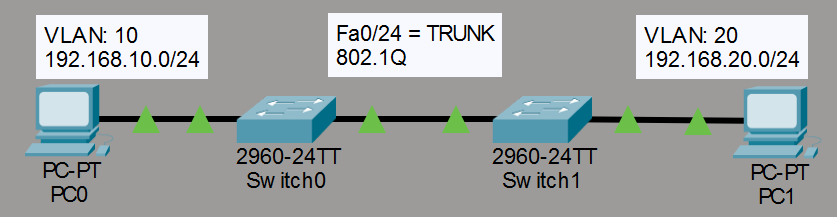

---

## Network Configuration

### VLAN 10 – SALES

- Network: 192.168.10.0/24
- PC0: 192.168.10.10
- PC1: 192.168.10.20

---

## PC Configuration

### PC0

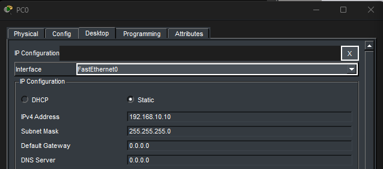

### PC1

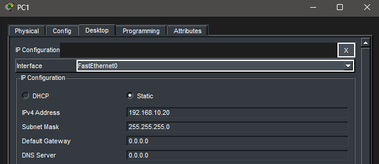

---

## VLAN Configuration

### SW0 VLAN Configuration

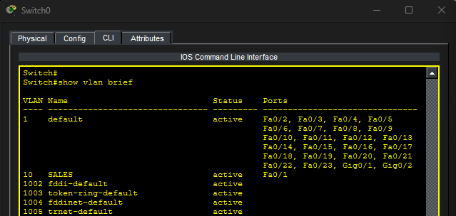

### SW1 VLAN Configuration

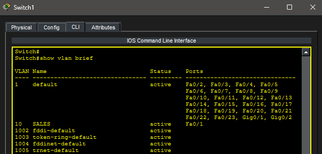

---

## Connectivity Test Before Trunking

A ping was attempted between PC0 and PC1 before configuring the trunk link.

Because the switch-to-switch link was operating as a normal access link, VLAN traffic could not traverse between switches.

### Failed Ping

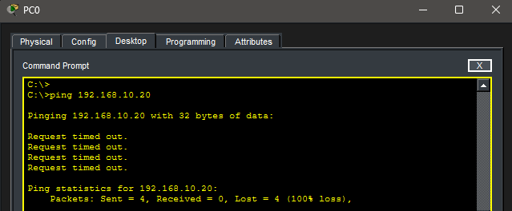

---

## Trunk Configuration

### SW0 Trunk Configuration

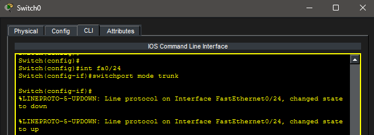

### SW1 Trunk Configuration

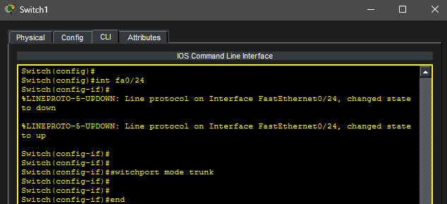

---

## Trunk Verification

### SW0

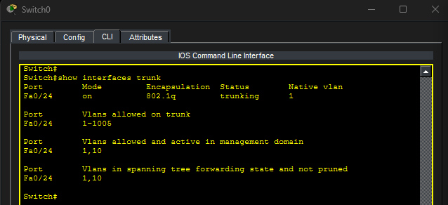

### SW1

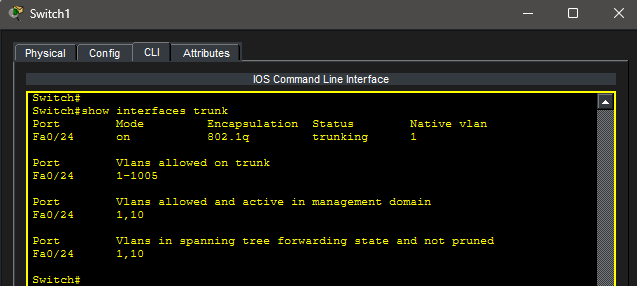

---

## Connectivity Test After Trunking

After configuring the trunk link, VLAN 10 traffic was able to travel between switches.

### Successful Ping

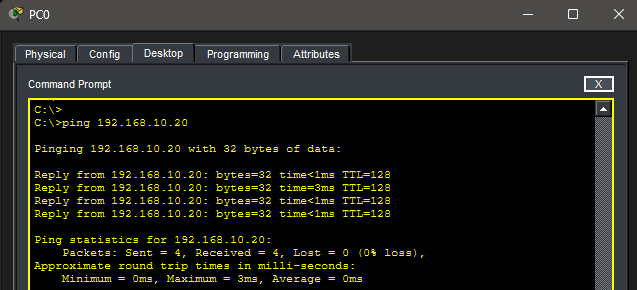

---

## Key Takeaways

- Trunk ports carry traffic for multiple VLANs across a single link.
- VLAN information is preserved using 802.1Q tagging.
- VLANs must exist on both switches for communication to occur.
- Access ports connect end devices to a specific VLAN.
- Trunk ports connect networking devices and transport VLAN traffic.

---

## Summary

This lab demonstrated how trunk ports allow VLAN traffic to traverse between switches. After creating VLAN 10 on both switches and configuring an 802.1Q trunk link, devices in the same VLAN successfully communicated across multiple switches.
