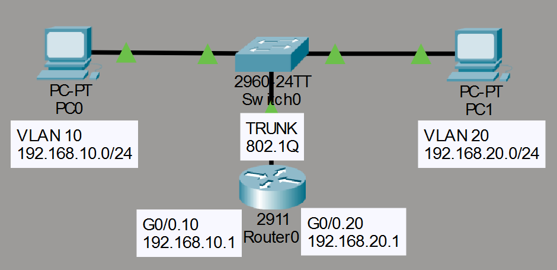
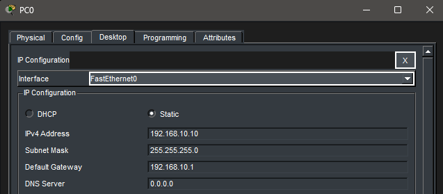
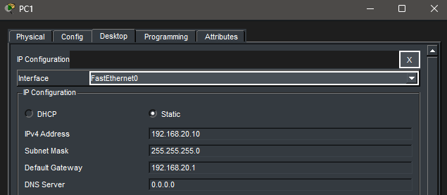
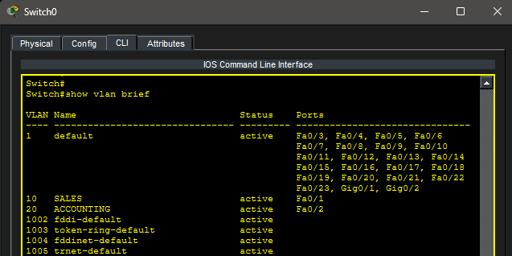
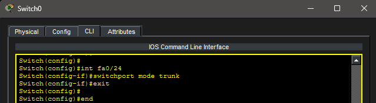
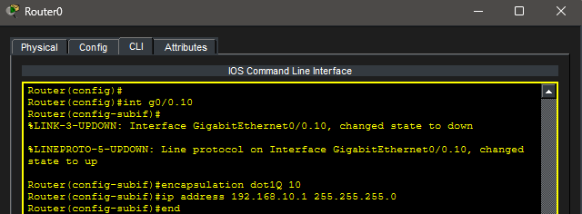
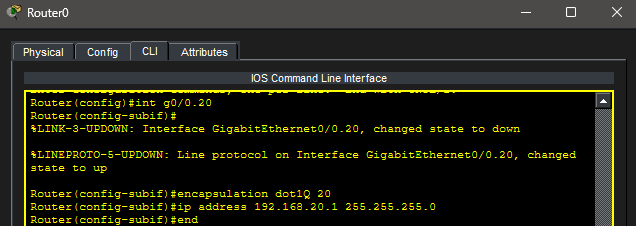
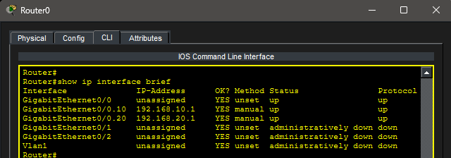
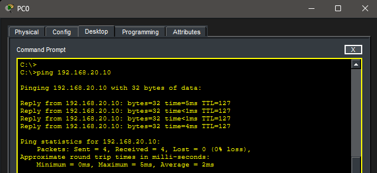

# Lab 10 – Inter-VLAN Routing (Router-on-a-Stick)

## Objective

Learn how routers enable communication between VLANs using Router-on-a-Stick. Configure VLANs, establish a trunk connection between a switch and router, create router subinterfaces, and verify communication between separate VLANs.

---

## Topology

A single switch connected to a router using an 802.1Q trunk link.



---

## Network Configuration

### VLAN 10 – SALES

- Network: 192.168.10.0/24
- Default Gateway: 192.168.10.1
- PC0: 192.168.10.10

### VLAN 20 – ACCOUNTING

- Network: 192.168.20.0/24
- Default Gateway: 192.168.20.1
- PC1: 192.168.20.10

---

## PC Configuration

### PC0



### PC1



---

## VLAN Configuration

Two VLANs were created on the switch:

- VLAN 10 – SALES
- VLAN 20 – ACCOUNTING

### VLAN Verification



---

## Trunk Configuration

The connection between SW0 and R0 was configured as an 802.1Q trunk.

### Trunk Configuration



---

## Router Subinterfaces

Router-on-a-Stick uses subinterfaces to route traffic between VLANs.

### VLAN 10 Subinterface



### VLAN 20 Subinterface



---

## Interface Verification

Router interfaces were verified using:

```bash
show ip interface brief
```

### Verification Output



---

## Inter-VLAN Connectivity Test

A ping was sent from PC0 in VLAN 10 to PC1 in VLAN 20.

Because the router was configured with VLAN subinterfaces and connected through an 802.1Q trunk, communication between VLANs was successful.

### Successful Ping



---

## Key Takeaways

- VLANs create separate broadcast domains.
- Devices in different VLANs require Layer 3 routing to communicate.
- Router-on-a-Stick uses router subinterfaces to route traffic between VLANs.
- 802.1Q trunking allows multiple VLANs to traverse a single physical connection.
- Default gateways provide hosts with a path to remote networks.

---

## Summary

This lab demonstrated Inter-VLAN Routing using Router-on-a-Stick. A trunk link was established between a switch and router, router subinterfaces were configured for multiple VLANs, and successful communication between VLAN 10 and VLAN 20 was verified.
