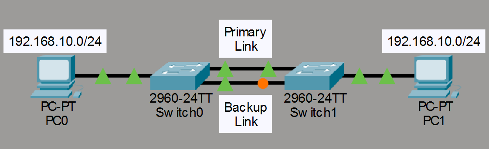
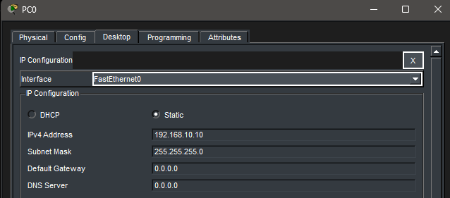
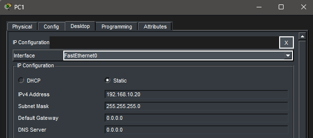
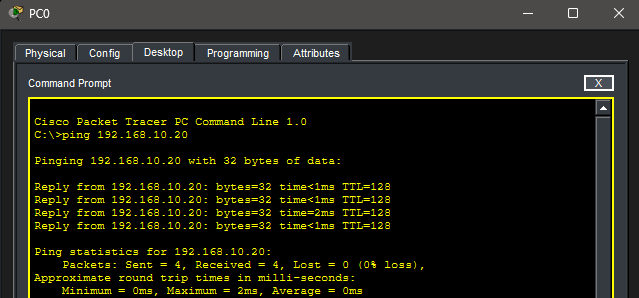
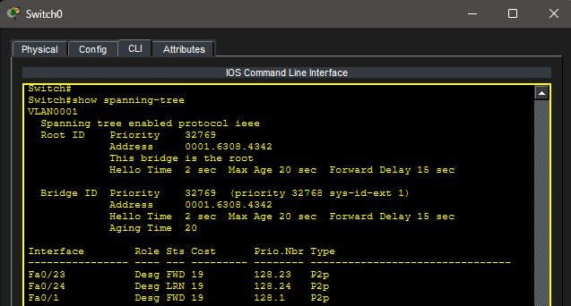
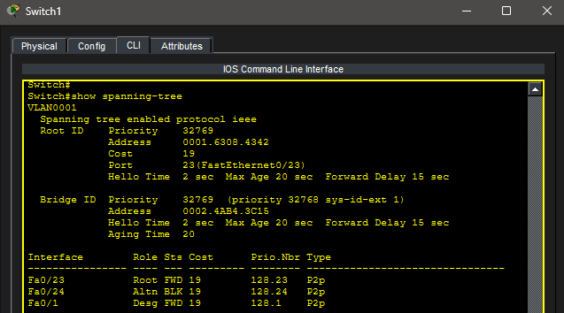
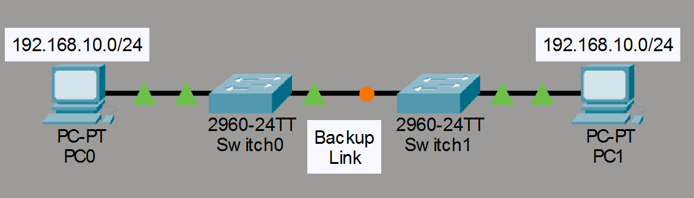
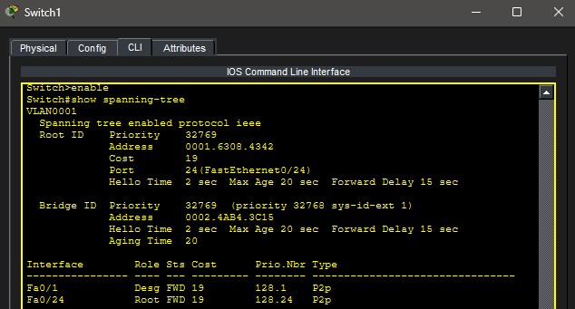
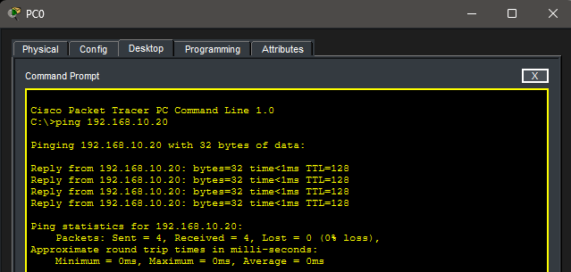

# Lab 11 – Spanning Tree Protocol (STP)

## Objective

Learn how Spanning Tree Protocol (STP) prevents Layer 2 loops by blocking redundant paths while maintaining network redundancy. Observe STP port states, identify the Root Bridge, and verify failover when an active link fails.

---

## Topology

Two switches connected by redundant links with end devices attached.

---

## Network Configuration

### Network

- Network: 192.168.10.0/24

### PC0

- IP Address: 192.168.10.10
- Subnet Mask: 255.255.255.0

### PC1

- IP Address: 192.168.10.20
- Subnet Mask: 255.255.255.0

---

## PC Configuration

### PC0

### PC1

---

## Initial Connectivity Test

A ping was sent from PC0 to PC1 to verify end-to-end connectivity.

### Successful Ping

---

## Spanning Tree Verification

STP was examined on both switches to identify the Root Bridge and determine which ports were forwarding traffic.

### SW0 STP Output

### SW1 STP Output

---

## Blocked Port Verification

One redundant switch link was automatically placed into a blocking state by STP to prevent a Layer 2 loop.

### STP Blocked Port

---

## Link Failure Simulation

The active forwarding link between switches was disconnected to simulate a failure.

### Failed Link Topology

---

## STP Convergence

After the active link failed, STP recalculated the topology and activated the previously blocked backup path.

### Post-Failure STP Output

---

## Connectivity After Failover

Connectivity was tested again after STP convergence.

### Successful Ping After Failover

---

## Key Takeaways

- Layer 2 loops can cause broadcast storms and network instability.
- STP prevents loops by blocking redundant paths.
- One switch becomes the Root Bridge.
- STP automatically recalculates paths when topology changes occur.
- Redundant links provide resiliency while STP prevents loops.
- Network connectivity is maintained after a link failure.

---

## Summary

This lab demonstrated how Spanning Tree Protocol prevents Layer 2 loops while maintaining redundant paths between switches. STP automatically blocked one redundant link, activated the backup path after a simulated failure, and preserved network connectivity throughout the topology change.
