# Lab 12 – EtherChannel

## Objective

Learn how EtherChannel combines multiple physical links into a single logical connection. Configure EtherChannel using LACP, verify operation, observe how STP interacts with EtherChannel, and test resiliency after a link failure.

---

## Topology

Two switches connected by multiple links bundled into a single EtherChannel.

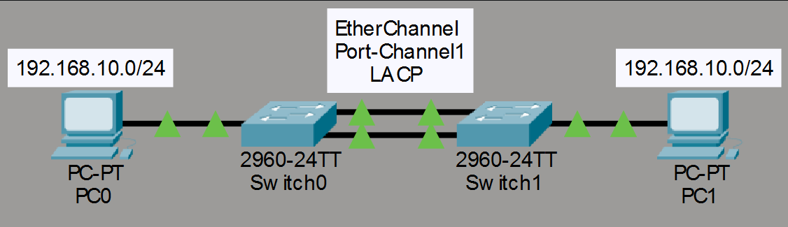

---

## Network Configuration

### Network

- Network: 192.168.10.0/24

### PC0

- IP Address: 192.168.10.10
- Subnet Mask: 255.255.255.0

### PC1

- IP Address: 192.168.10.20
- Subnet Mask: 255.255.255.0

---

## PC Configuration

### PC0

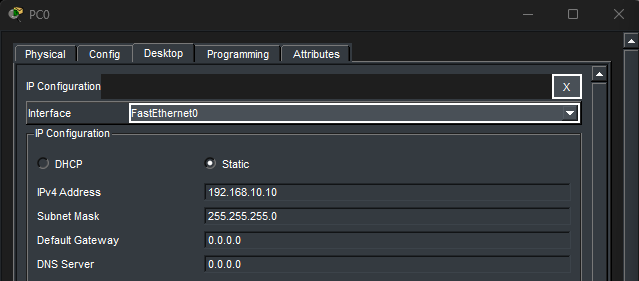

### PC1

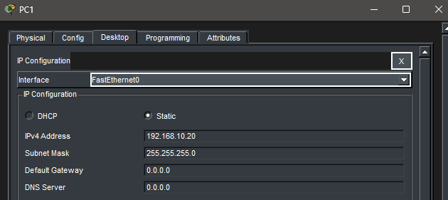

---

## Initial Connectivity Test

Connectivity was verified before configuring EtherChannel.

### Successful Ping

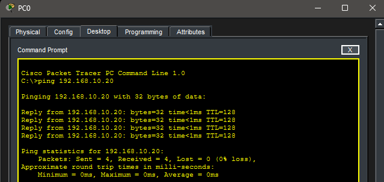

---

## EtherChannel Configuration

LACP was used to bundle Fa0/23 and Fa0/24 into Port-Channel1.

### SW0 EtherChannel Configuration

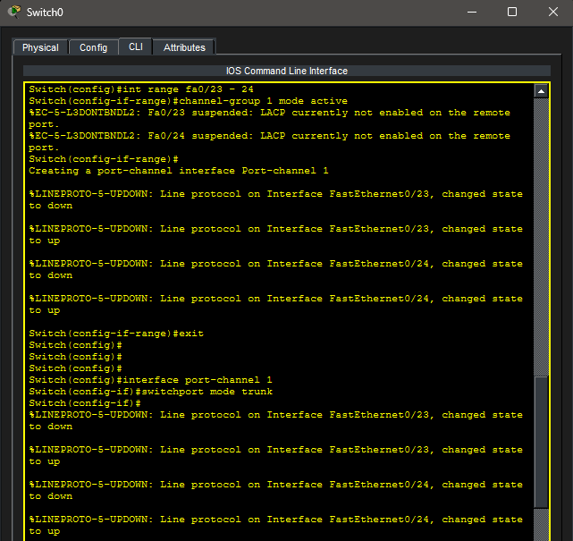

### SW1 EtherChannel Configuration

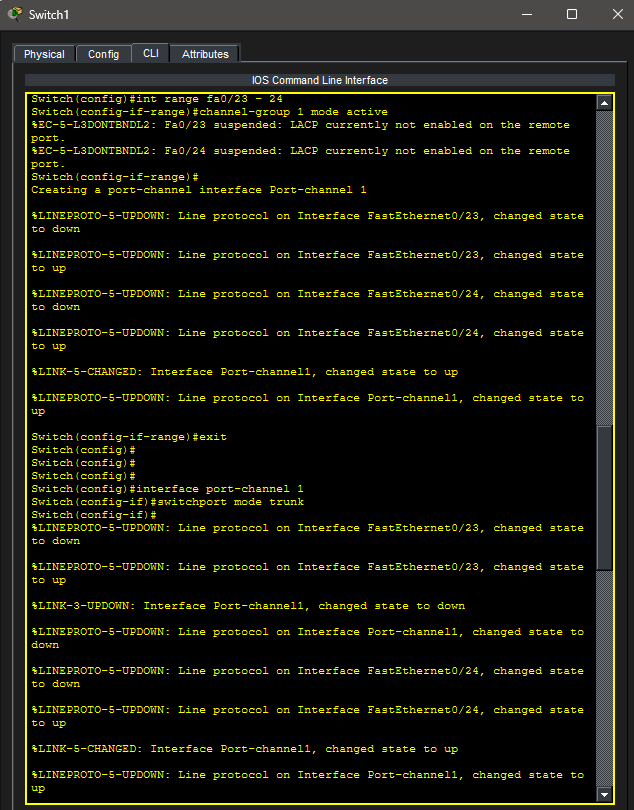

---

## EtherChannel Verification

EtherChannel status was verified using:

```bash
show etherchannel summary
```

### SW0 Verification

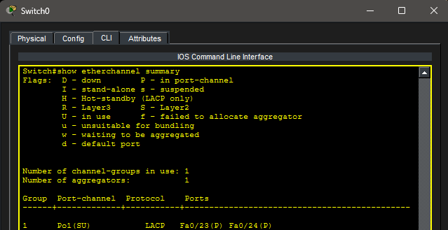

### SW1 Verification

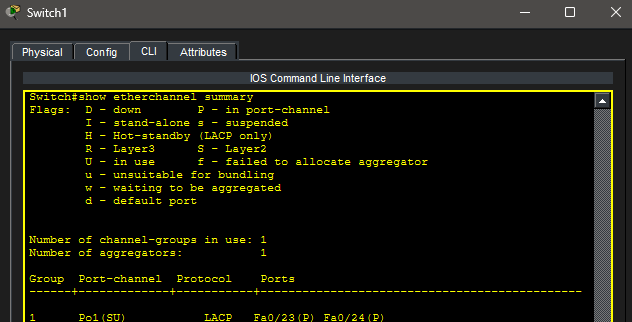

---

## STP Verification

Spanning Tree Protocol recognizes the EtherChannel as a single logical interface.

### SW0 STP Output

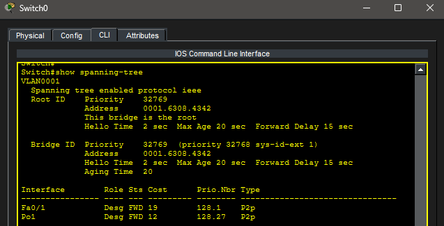

### SW1 STP Output

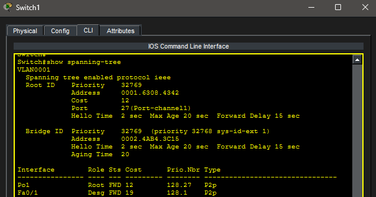

---

## Link Failure Simulation

One physical EtherChannel member link was disconnected.

### Failed Link Topology

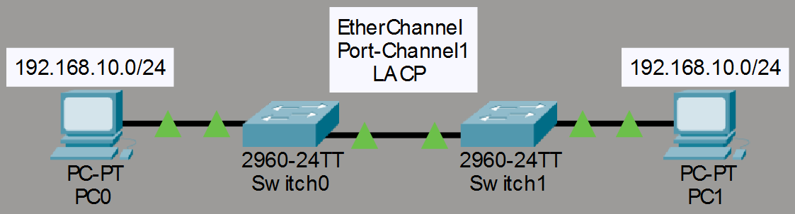

---

## Connectivity After Link Failure

Communication remained operational because the remaining EtherChannel member link continued forwarding traffic.

### Successful Ping After Failure

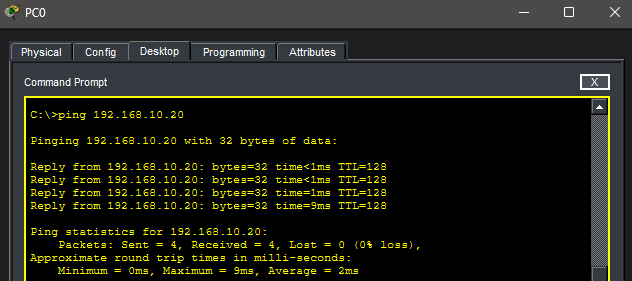

---

## Key Takeaways

- EtherChannel combines multiple physical links into one logical connection.
- LACP dynamically negotiates EtherChannel membership.
- EtherChannel increases bandwidth and redundancy.
- STP treats an EtherChannel as a single logical interface.
- EtherChannel prevents bandwidth from being wasted by blocked redundant links.
- Connectivity remains operational even when a member link fails.

---

## Summary

This lab demonstrated EtherChannel using LACP to combine multiple switch links into a single logical connection. EtherChannel improved redundancy, maintained connectivity after a link failure, and allowed STP to operate without blocking individual member links.
