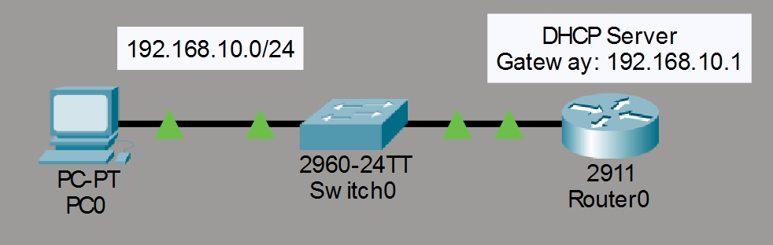
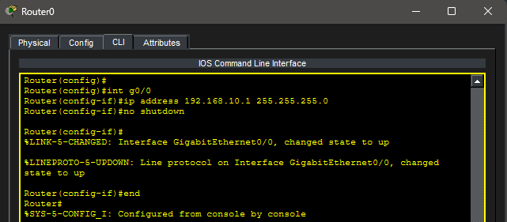
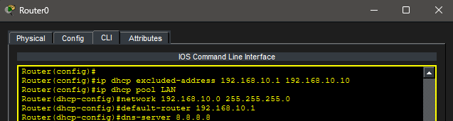
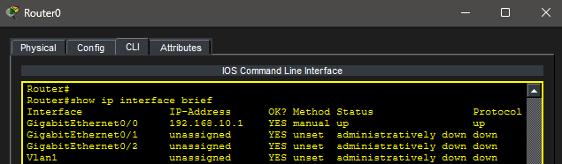
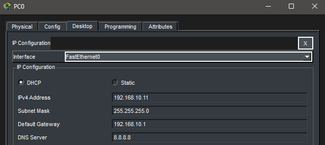
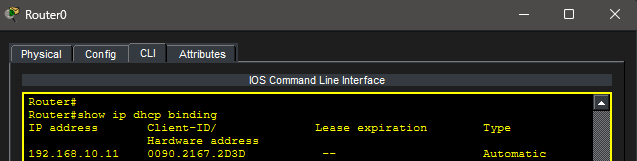
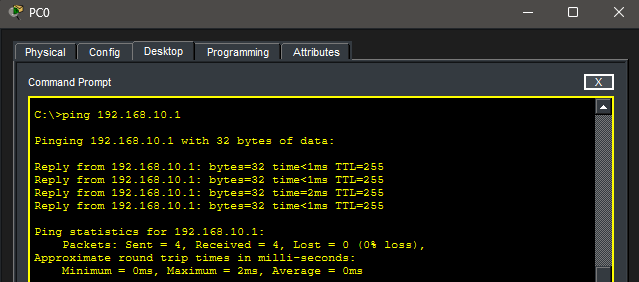

# Lab 13 – DHCP (Dynamic Host Configuration Protocol)

## Objective

Learn how DHCP automatically assigns IP addresses and network settings to hosts. Configure a router as a DHCP server, create a DHCP pool, verify address assignment, and examine DHCP lease information.

---

## Topology

A router acting as a DHCP server connected to a switch and client PC.



---

## Network Configuration

### Network

- Network: 192.168.10.0/24

### Default Gateway

- 192.168.10.1

### DHCP Scope

- Network: 192.168.10.0/24
- Excluded Addresses: 192.168.10.1 - 192.168.10.10
- DNS Server: 8.8.8.8

---

## Router Interface Configuration

The router interface was configured as the default gateway for the network.

### Router G0/0 Configuration



---

## DHCP Pool Configuration

A DHCP pool named **LAN** was created to automatically assign IP addresses to clients.

### DHCP Pool Configuration



---

## Interface Verification

Router interface status was verified using:

```bash
show ip interface brief
```

### Interface Verification



---

## DHCP Client Configuration

PC0 was configured to obtain an address automatically using DHCP.

### DHCP Address Assignment



---

## DHCP Lease Verification

The router DHCP lease table was verified using:

```bash
show ip dhcp binding
```

### DHCP Binding Table



---

## Connectivity Test

Connectivity between the DHCP client and the default gateway was verified.

### Successful Ping



---

## Key Takeaways

- DHCP automates IP address assignment.
- DHCP can provide IP addresses, subnet masks, default gateways, and DNS servers.
- Excluded addresses prevent specific IP addresses from being leased.
- Routers can function as DHCP servers.
- DHCP leases can be verified using the binding table.
- DHCP reduces administrative overhead and configuration errors.

---

## Summary

This lab demonstrated DHCP configuration on a Cisco router. A DHCP pool was created, a client successfully received an automatically assigned IP address, and connectivity was verified using the DHCP-provided network configuration.
