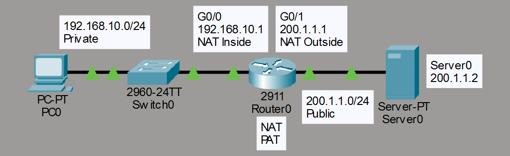
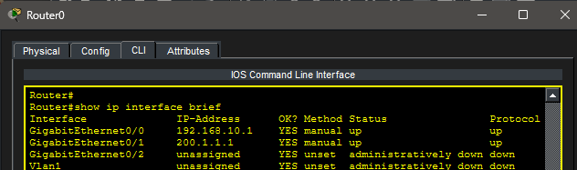
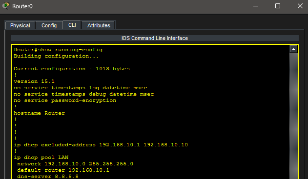
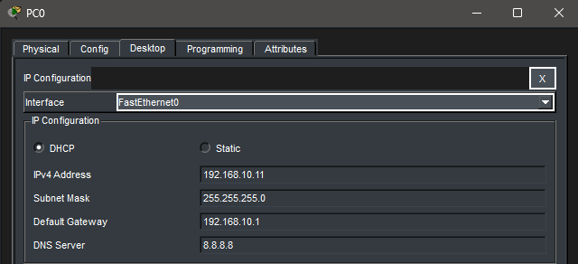
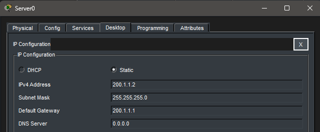
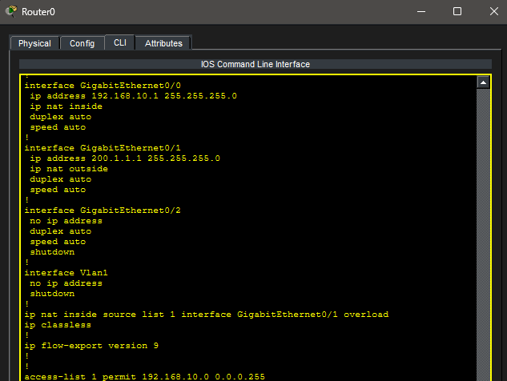
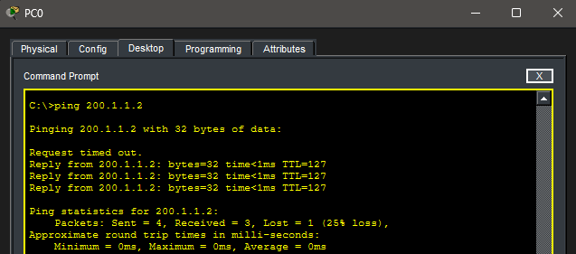
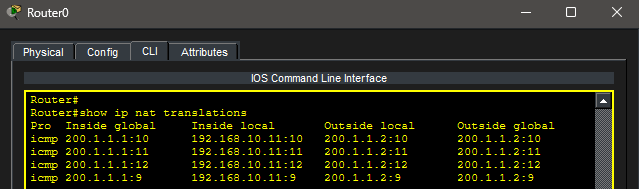

# Lab 14 – NAT (Network Address Translation)

## Objective

Learn how Network Address Translation (NAT) allows private IP addresses to communicate with public networks. Configure NAT overload (PAT), verify address translation, and observe how private addresses are translated into routable addresses.

---

## Topology

A private LAN connected to a simulated public network through a router performing NAT.

---

## Network Configuration

### Private Network

- Network: 192.168.10.0/24
- Default Gateway: 192.168.10.1

### Public Network

- Network: 200.1.1.0/24

### Devices

#### PC0

- DHCP Assigned Address
- Located on the private LAN

#### R0

- G0/0: 192.168.10.1 (NAT Inside)
- G0/1: 200.1.1.1 (NAT Outside)

#### Server0

- IP Address: 200.1.1.2
- Default Gateway: 200.1.1.1

---

## Interface Verification

Router interfaces were verified to ensure both LAN and WAN connections were operational.

### Router Interface Status

---

## DHCP Configuration

The router was configured as a DHCP server to automatically assign addresses to hosts on the private network.

### DHCP Configuration

---

## DHCP Client Verification

PC0 successfully received an IP address from the DHCP server.

### DHCP Address Assignment

---

## Public Network Configuration

Server0 was configured to represent a public host reachable through NAT.

### Server0 Configuration

---

## NAT Configuration

NAT overload (PAT) was configured on the router.

### NAT Inside/Outside Configuration

---

## Connectivity Test

PC0 successfully communicated with Server0 across the NAT boundary.

### Successful Ping

---

## NAT Translation Verification

The NAT translation table was examined to verify address translation.

### NAT Translation Table

---

## Key Takeaways

- Private IP addresses are not routable on public networks.
- NAT translates private addresses into public addresses.
- PAT allows multiple hosts to share a single public IP address.
- NAT uses inside and outside interfaces to determine translation boundaries.
- Access control lists identify traffic eligible for translation.
- NAT translation tables can be used to verify operation.

---

## Summary

This lab demonstrated Network Address Translation using NAT overload (PAT). A private LAN was connected to a simulated public network, DHCP assigned addresses automatically, and successful communication was achieved through address translation. NAT translations were verified using router commands.
