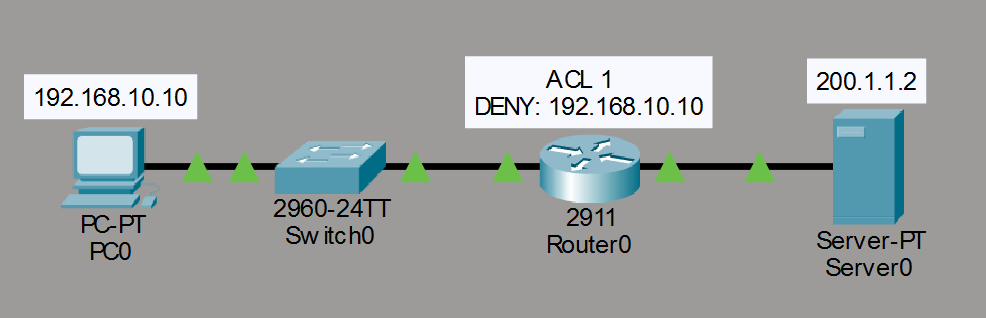
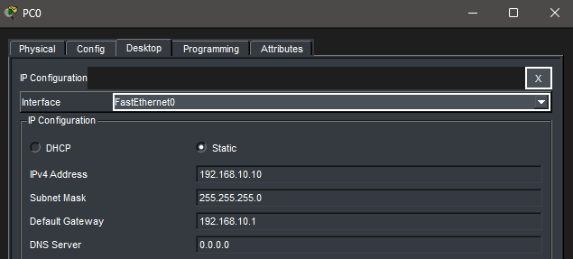
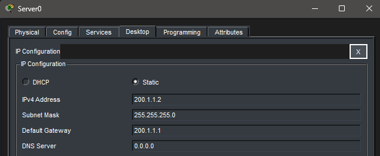
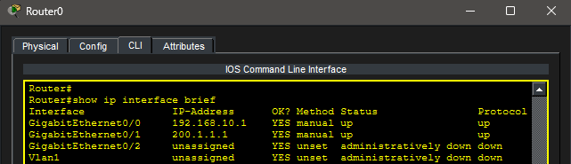
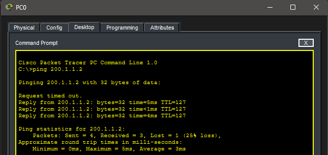
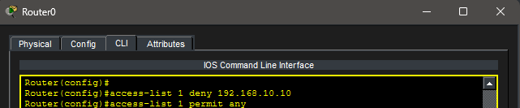
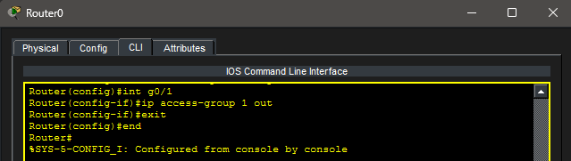
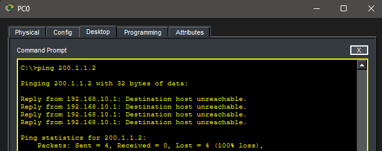
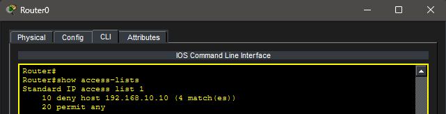
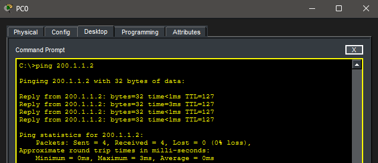

# Lab 15 – Standard ACLs (Access Control Lists)

## Objective

Learn how Standard Access Control Lists (ACLs) can be used to filter traffic based on source IP addresses. Configure an ACL, apply it to a router interface, verify that traffic is blocked, and then restore connectivity by removing the ACL.

---

## Topology

A client PC connected to a server through a router.



---

## Network Configuration

### LAN Network

- Network: 192.168.10.0/24

### WAN Network

- Network: 200.1.1.0/24

### Devices

#### PC0

- IP Address: 192.168.10.10
- Subnet Mask: 255.255.255.0
- Default Gateway: 192.168.10.1

#### R0

- G0/0: 192.168.10.1
- G0/1: 200.1.1.1

#### Server0

- IP Address: 200.1.1.2
- Subnet Mask: 255.255.255.0
- Default Gateway: 200.1.1.1

---

## Device Configuration

### PC0 Configuration



### Server0 Configuration



### Router Interface Verification



---

## Initial Connectivity Test

Connectivity between PC0 and Server0 was verified before applying the ACL.

### Successful Ping Before ACL



---

## ACL Configuration

A Standard ACL was created to deny traffic sourced from PC0.

### ACL Configuration



ACL Entries:

```text
access-list 1 deny 192.168.10.10
access-list 1 permit any
```

---

## Applying the ACL

The ACL was applied outbound on interface G0/1.

### ACL Applied To Interface



---

## Connectivity Test After ACL

Traffic from PC0 was blocked after the ACL was applied.

### Failed Ping



---

## ACL Verification

ACL hit counters were verified using:

```bash
show access-lists
```

### ACL Statistics



---

## ACL Removal

The ACL was removed from the interface.

```bash
interface g0/1
no ip access-group 1 out
```

---

## Connectivity Restoration

Traffic was tested again after removing the ACL.

### Successful Ping After ACL Removal



---

## Key Takeaways

- Standard ACLs filter traffic based only on source IP addresses.
- ACLs are processed top-down.
- ACLs contain an implicit deny at the end.
- ACLs can be applied inbound or outbound on interfaces.
- ACL hit counters provide verification that ACLs are functioning.
- Removing an ACL immediately restores traffic flow.

---

## Summary

This lab demonstrated the use of Standard Access Control Lists to control network traffic. A Standard ACL was configured to block traffic from a specific source IP address, applied to a router interface, verified using hit counters, and later removed to restore connectivity.
