# Lab 16 – Extended ACLs

## Objective

Learn how Extended Access Control Lists (ACLs) provide granular traffic filtering based on source address, destination address, protocol, and port number. Configure an Extended ACL to block HTTP traffic while allowing ICMP traffic and verify operation through testing.

---

## Topology

A client PC connected to a web server through a router.

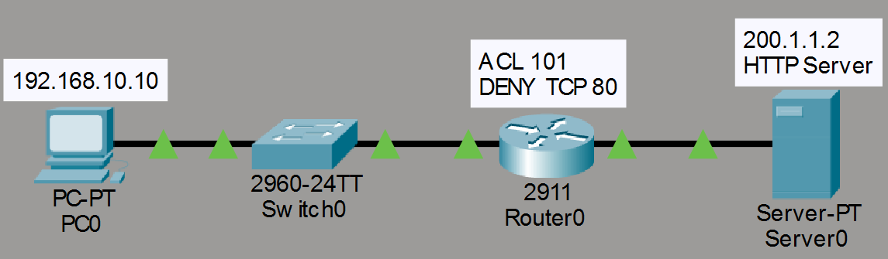

---

## Network Configuration

### LAN Network

- Network: 192.168.10.0/24

### WAN Network

- Network: 200.1.1.0/24

### Devices

#### PC0

- IP Address: 192.168.10.10
- Subnet Mask: 255.255.255.0
- Default Gateway: 192.168.10.1

#### R0

- G0/0: 192.168.10.1
- G0/1: 200.1.1.1

#### Server0

- IP Address: 200.1.1.2
- Subnet Mask: 255.255.255.0
- Default Gateway: 200.1.1.1
- HTTP Service Enabled

---

## Device Configuration

### PC0 Configuration

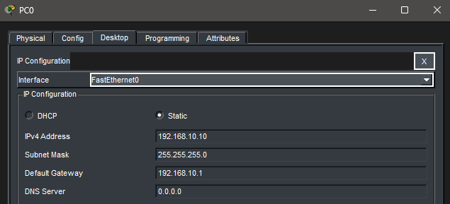

### Server0 Configuration

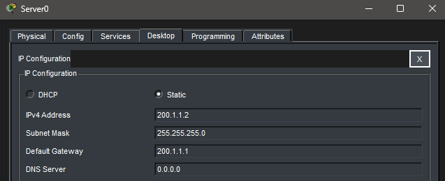

### Router Interface Verification

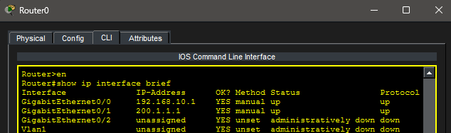

---

## Initial Connectivity Tests

### Successful Ping Before ACL

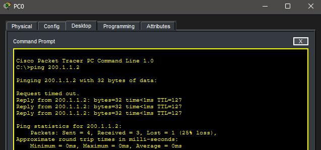

### Successful HTTP Access Before ACL

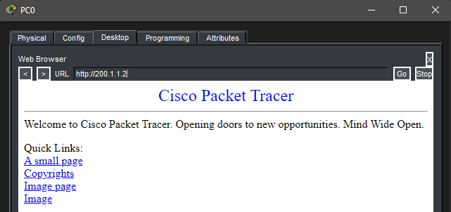

---

## Extended ACL Configuration

ACL 101 was created to block HTTP traffic destined for Server0 while allowing all other traffic.

### ACL Configuration

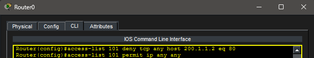

ACL Entries:

```text
access-list 101 deny tcp any host 200.1.1.2 eq 80
access-list 101 permit ip any any
```

---

## ACL Application

The ACL was applied outbound on interface G0/1.

### ACL Applied To Interface

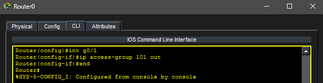

---

## Testing After ACL Deployment

### Successful Ping After ACL

ICMP traffic continued to function.

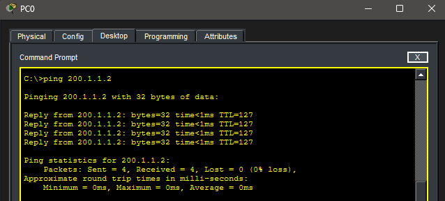

### Failed HTTP Access After ACL

HTTP traffic was successfully blocked.

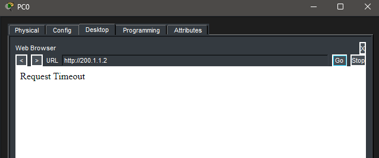

---

## ACL Verification

ACL hit counters were examined using:

```bash
show access-lists
```

### ACL Statistics

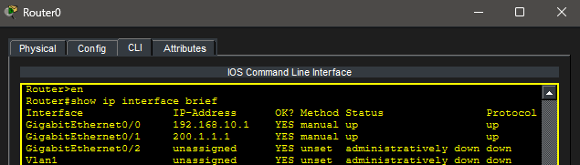

---

## ACL Removal

The ACL was removed from the interface.

```bash
interface g0/1
no ip access-group 101 out
```

---

## Connectivity Restoration

HTTP connectivity was restored after ACL removal.

### Successful HTTP Access After ACL Removal

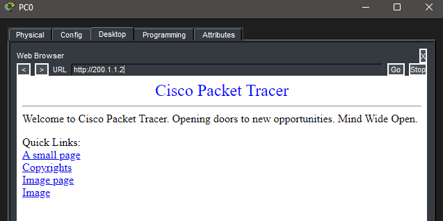

---

## Key Takeaways

- Extended ACLs can filter traffic by protocol and port number.
- ACLs are processed sequentially from top to bottom.
- ACLs contain an implicit deny statement.
- HTTP uses TCP port 80.
- ICMP and HTTP can be treated differently by ACL rules.
- Extended ACLs provide more granular control than Standard ACLs.

---

## Summary

This lab demonstrated the implementation of an Extended ACL to selectively block HTTP traffic while allowing ICMP traffic. ACL functionality was verified using connectivity testing and ACL hit counters, illustrating how Extended ACLs provide precise traffic filtering capabilities.
