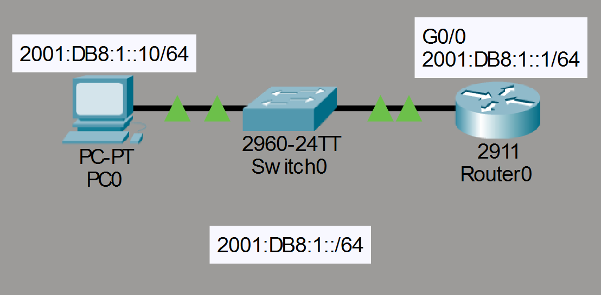
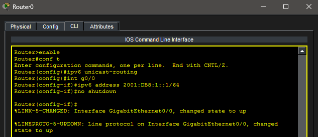
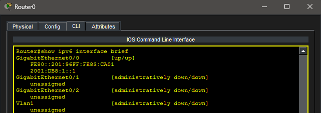
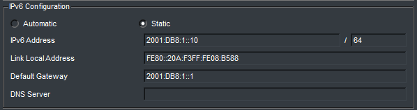
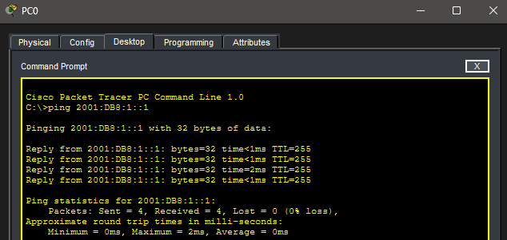
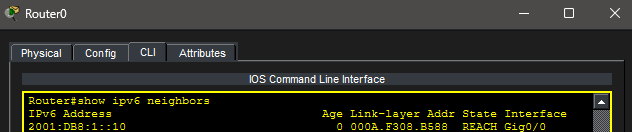
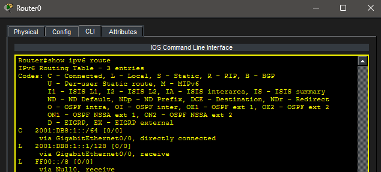

# Lab 17 – IPv6 Fundamentals

## Objective

Learn the fundamentals of IPv6 addressing by configuring IPv6 on a router and host, enabling IPv6 routing, verifying neighbor discovery, and testing end-to-end IPv6 connectivity.

---

## Topology

A single IPv6 LAN connected through a Cisco router.



---

## Network Configuration

### IPv6 Network

- Network Prefix: 2001:DB8:1::/64

### Devices

#### PC0

- IPv6 Address: 2001:DB8:1::10/64
- Default Gateway: 2001:DB8:1::1

#### R0

- G0/0: 2001:DB8:1::1/64
- IPv6 Routing Enabled

---

## Router Configuration

IPv6 routing was enabled globally on the router, and an IPv6 address was assigned to the LAN interface.

### Router IPv6 Configuration



---

## Interface Verification

Router interfaces were verified using:

```bash
show ipv6 interface brief
```

### IPv6 Interface Brief



---

## PC Configuration

PC0 was manually configured with an IPv6 address and default gateway.

### PC0 IPv6 Configuration



---

## Connectivity Test

IPv6 connectivity between PC0 and R0 was verified.

### Successful IPv6 Ping



---

## Neighbor Discovery Verification

IPv6 Neighbor Discovery Protocol (NDP) was verified using:

```bash
show ipv6 neighbors
```

### IPv6 Neighbor Table



---

## Routing Table Verification

The IPv6 routing table was examined using:

```bash
show ipv6 route
```

### IPv6 Routing Table



---

## Key Takeaways

- IPv6 uses 128-bit addresses.
- Prefix lengths replace subnet masks.
- IPv6 interfaces automatically generate link-local addresses (FE80::/10).
- Neighbor Discovery Protocol (NDP) replaces ARP.
- IPv6 routing must be enabled using `ipv6 unicast-routing`.
- Connectivity can be verified using standard ping commands with IPv6 addresses.

---

## Summary

This lab introduced IPv6 fundamentals by configuring IPv6 addressing on a router and host, enabling IPv6 routing, verifying Neighbor Discovery, and confirming successful IPv6 communication across the network.
