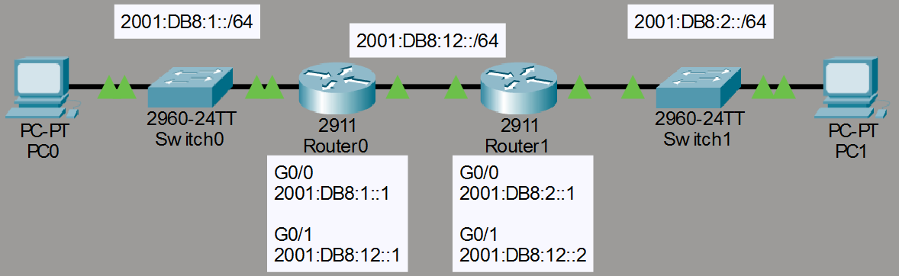
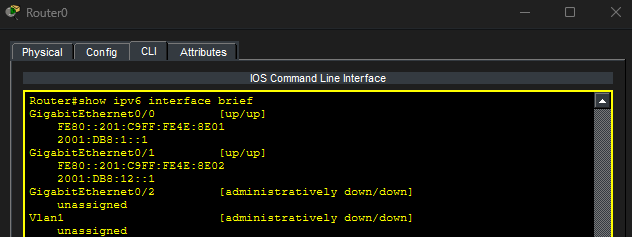
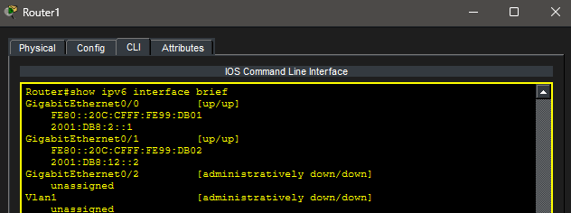
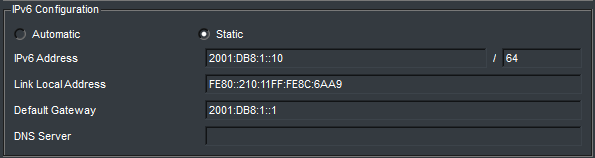
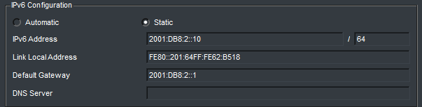
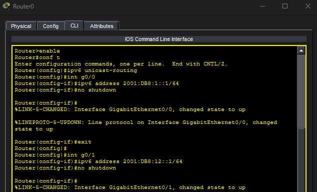
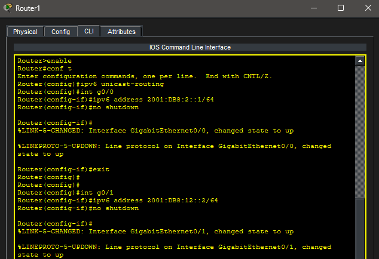
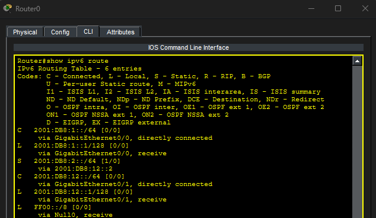
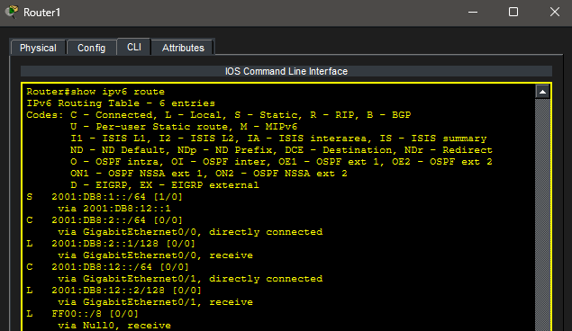
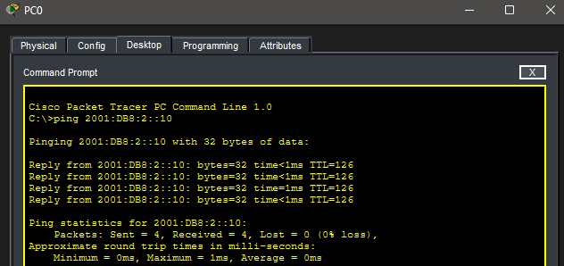

# Lab 18 – IPv6 Static Routing

## Objective

Learn how to configure static routing in an IPv6 network. Build a two-router topology, configure IPv6 addressing on LAN and WAN interfaces, create static IPv6 routes, verify routing tables, and test end-to-end IPv6 connectivity.

---

## Topology

A two-router IPv6 network connecting two LANs.



---

## Network Configuration

### LAN 1

- Network Prefix: 2001:DB8:1::/64

#### PC0

- IPv6 Address: 2001:DB8:1::10/64
- Default Gateway: 2001:DB8:1::1

#### R0 G0/0

- IPv6 Address: 2001:DB8:1::1/64

---

### WAN

- Network Prefix: 2001:DB8:12::/64

#### R0 G0/1

- IPv6 Address: 2001:DB8:12::1/64

#### R1 G0/1

- IPv6 Address: 2001:DB8:12::2/64

---

### LAN 2

- Network Prefix: 2001:DB8:2::/64

#### R1 G0/0

- IPv6 Address: 2001:DB8:2::1/64

#### PC1

- IPv6 Address: 2001:DB8:2::10/64
- Default Gateway: 2001:DB8:2::1

---

## Router Interface Configuration

IPv6 routing was enabled on both routers and IPv6 addresses were assigned to each interface.

### R0 Interface Configuration



### R1 Interface Configuration



---

## PC Configuration

### PC0 IPv6 Configuration



### PC1 IPv6 Configuration



---

## Static Route Configuration

### R0 Static Route

Configured to reach the remote LAN behind R1.



Example:

```text
ipv6 route 2001:DB8:2::/64 2001:DB8:12::2
```

---

### R1 Static Route

Configured to reach the remote LAN behind R0.



Example:

```text
ipv6 route 2001:DB8:1::/64 2001:DB8:12::1
```

---

## Routing Table Verification

The IPv6 routing tables were verified on both routers.

### R0 IPv6 Routing Table



### R1 IPv6 Routing Table



---

## Connectivity Test

End-to-end IPv6 connectivity between both LANs was successfully verified.

### Successful End-to-End IPv6 Ping



---

## Key Takeaways

- IPv6 static routes use the `ipv6 route` command.
- Routers must have IPv6 routing enabled with `ipv6 unicast-routing`.
- Prefix lengths replace subnet masks.
- Static routes appear in the routing table with the `S` code.
- IPv6 routing follows the same concepts as IPv4 routing.
- Successful end-to-end communication confirms proper route configuration.

---

## Summary

This lab demonstrated IPv6 static routing between two routers. IPv6 addresses were configured on LAN and WAN interfaces, static routes were created on each router, routing tables were verified, and successful end-to-end communication was established between both IPv6 LANs.
