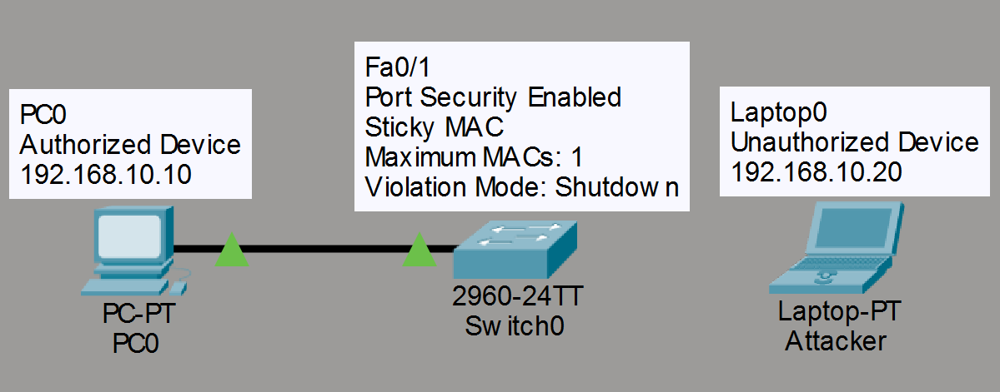
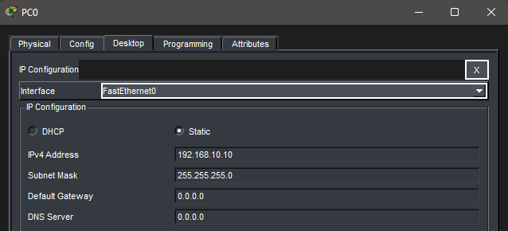
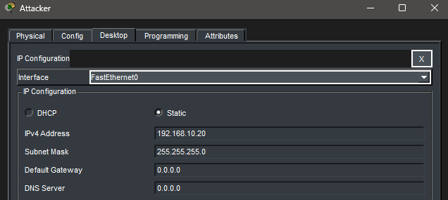
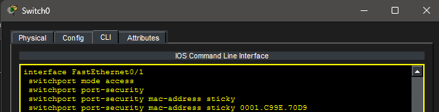
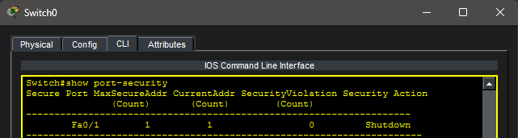
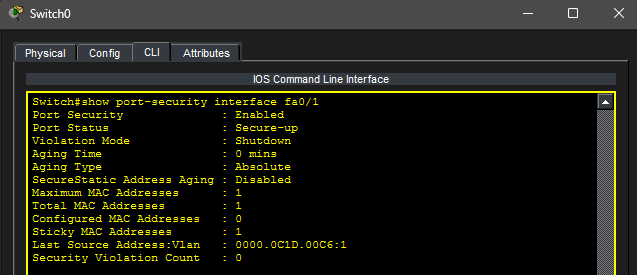
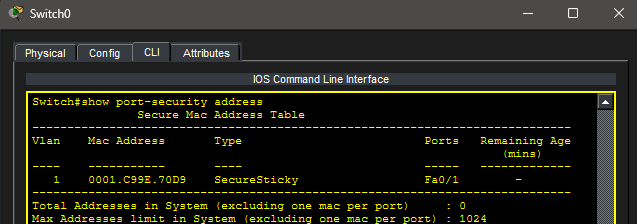
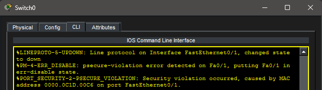
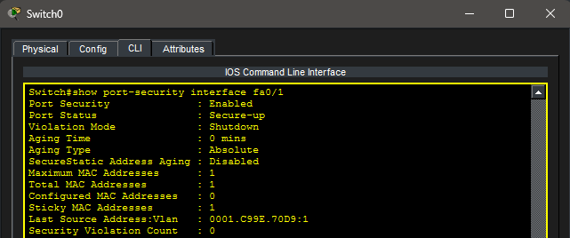

# Lab 19 – Switch Port Security

## Objective

Learn how to configure Cisco Port Security to restrict access to a switchport, automatically learn authorized MAC addresses using Sticky MAC, detect unauthorized devices, recover from security violations, and verify switch security using Cisco IOS commands.

---

## Topology

A single access-layer switch with one authorized workstation and one unauthorized laptop used to simulate a security violation.



---

## Network Configuration

### LAN Network

- Network: 192.168.10.0/24

### Devices

#### PC0 (Authorized Device)

- IP Address: 192.168.10.10
- Subnet Mask: 255.255.255.0

#### Laptop0 (Unauthorized Device)

- IP Address: 192.168.10.20
- Subnet Mask: 255.255.255.0

#### SW0

- FastEthernet0/1
  - Port Security Enabled
  - Sticky MAC Enabled
  - Maximum MAC Addresses: 1
  - Violation Mode: Shutdown

---

## Device Configuration

### PC0 Configuration



### Laptop0 Configuration



---

## Port Security Configuration

Port Security was configured on FastEthernet0/1 to automatically learn the first connected MAC address and allow only one device on the interface.

### Switch Port Security Configuration



Configured options:

```text
switchport mode access
switchport port-security
switchport port-security maximum 1
switchport port-security mac-address sticky
switchport port-security violation shutdown
```

---

## Sticky MAC Verification

After generating traffic from PC0, the switch learned and stored the authorized MAC address.

### Port Security Status



### Interface Details



### Learned Sticky MAC Address



---

## Security Violation Test

PC0 was disconnected and replaced with Laptop0. When the unauthorized device generated traffic, the switch detected a different MAC address and placed the interface into a secure shutdown state.

### Security Violation



---

## Recovery

The authorized device was reconnected and the interface was recovered using:

```text
interface fa0/1
shutdown
no shutdown
```

### Authorized Device Restored



---

## Troubleshooting

### Issue

After replacing the authorized PC with an unauthorized laptop, FastEthernet0/1 entered a secure shutdown state due to a Port Security violation.

### Cause

Port Security detected a MAC address that did not match the previously learned Sticky MAC address.

### Resolution

- Reconnected the authorized workstation.
- Reset the interface using:

```text
interface fa0/1
shutdown
no shutdown
```

- Verified recovery using:

```text
show port-security
show port-security interface fa0/1
```

---

## Real-World Application

Port Security is commonly deployed on access-layer switches to prevent unauthorized devices from connecting to enterprise networks. Sticky MAC learning allows switches to automatically remember authorized devices while minimizing administrative overhead. Security violations can be logged, restricted, or configured to disable the interface depending on organizational security policies.

---

## Key Takeaways

- Port Security limits which devices may connect to a switchport.
- Sticky MAC automatically learns and stores authorized MAC addresses.
- Violation modes determine how the switch responds to unauthorized devices.
- Shutdown mode is the most secure option and requires administrative recovery.
- Port Security can be monitored using Cisco IOS verification commands.
- This feature is widely used on enterprise access-layer switches.

---

## Summary

This lab demonstrated Cisco Switch Port Security by configuring Sticky MAC learning, limiting the number of permitted MAC addresses, simulating an unauthorized device connection, recovering the interface after a security violation, and verifying proper operation using Cisco IOS commands.
