# Lab 20 – OSPFv3 (IPv6)

## Objective

Learn how to configure OSPFv3 to dynamically exchange IPv6 routing information between routers. Configure IPv6 interfaces, establish OSPFv3 neighbor relationships, verify dynamically learned routes, and test end-to-end IPv6 connectivity across multiple networks.

---

## Topology

A two-router IPv6 network connected through an OSPFv3 Area 0 backbone.

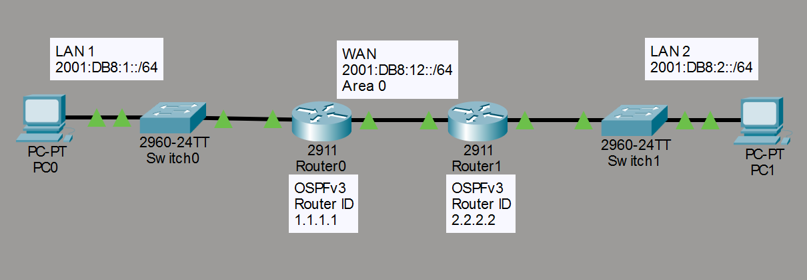

---

## Network Configuration

### LAN 1

- Network Prefix: 2001:DB8:1::/64

#### PC0

- IPv6 Address: 2001:DB8:1::10/64
- Default Gateway: 2001:DB8:1::1

#### R0 G0/0

- IPv6 Address: 2001:DB8:1::1/64

---

### WAN

- Network Prefix: 2001:DB8:12::/64

#### R0 G0/1

- IPv6 Address: 2001:DB8:12::1/64

#### R1 G0/1

- IPv6 Address: 2001:DB8:12::2/64

---

### LAN 2

- Network Prefix: 2001:DB8:2::/64

#### PC1

- IPv6 Address: 2001:DB8:2::10/64
- Default Gateway: 2001:DB8:2::1

#### R1 G0/0

- IPv6 Address: 2001:DB8:2::1/64

---

## Router Configuration

IPv6 routing was enabled on both routers, and OSPFv3 was configured directly on the participating interfaces.

### R0 OSPFv3 Configuration

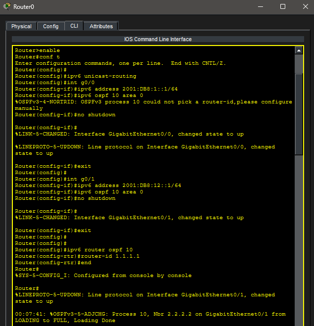

### R1 OSPFv3 Configuration

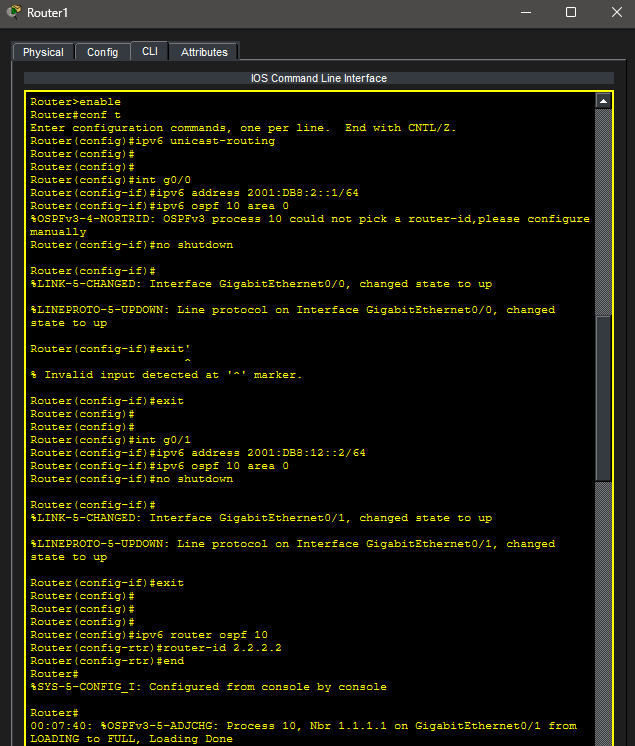

---

## Interface Verification

Router interfaces were verified using:

```text
show ipv6 interface brief
```

### R0 Interface Brief

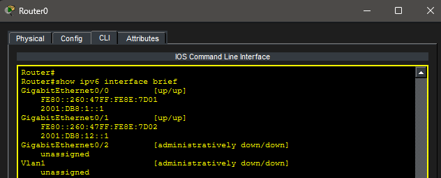

### R1 Interface Brief

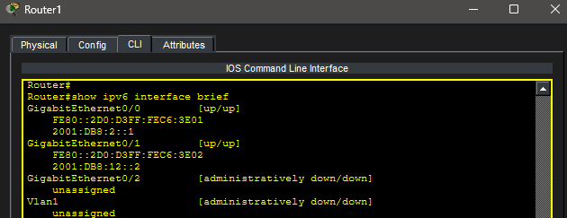

---

## PC Configuration

### PC0 IPv6 Configuration

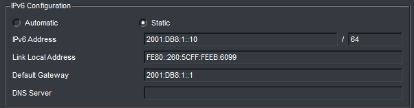

### PC1 IPv6 Configuration

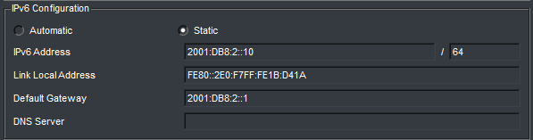

---

## OSPFv3 Neighbor Verification

Neighbor relationships were successfully established between both routers.

### R0 OSPFv3 Neighbor

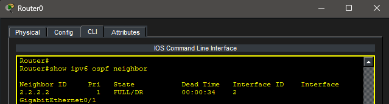

### R1 OSPFv3 Neighbor

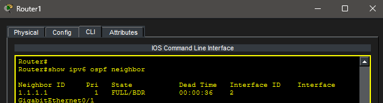

---

## Routing Table Verification

Dynamic IPv6 routes learned through OSPFv3 were verified on both routers.

### R0 IPv6 Routing Table

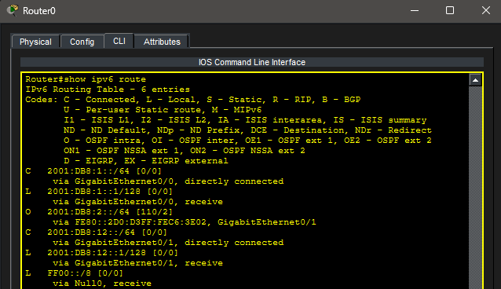

### R1 IPv6 Routing Table

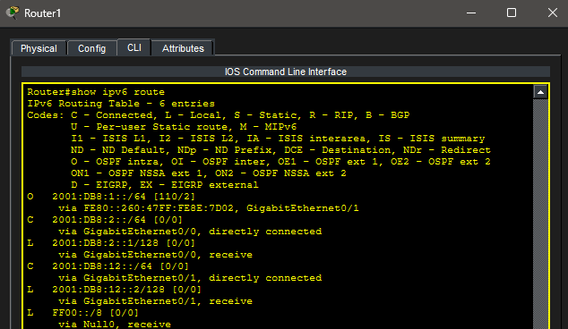

> **Note:** In Cisco Packet Tracer, OSPFv3-learned routes are displayed using the `O` route code.

---

## Connectivity Test

End-to-end IPv6 communication was successfully verified between both LANs.

### Successful IPv6 OSPF Ping

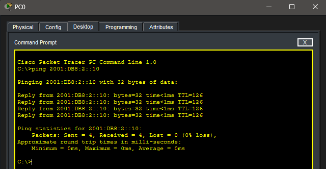

---

## Troubleshooting

### Issue

Initially, the IPv6 routing table did not display the expected OSPF route code.

### Cause

Packet Tracer displays OSPFv3 learned routes with the route code `O`, rather than `OI` as commonly referenced in some Cisco documentation and study materials.

### Resolution

Verified that:

- OSPFv3 neighbors successfully formed.
- Dynamic routes appeared with the `O` route code.
- End-to-end IPv6 connectivity was successful.

The routing table confirmed that OSPFv3 was operating correctly.

---

## Real-World Application

OSPFv3 is widely used in enterprise environments to dynamically exchange IPv6 routing information between routers. Unlike static routing, OSPFv3 automatically discovers neighboring routers, advertises network changes, and recalculates routes whenever the network topology changes. This greatly reduces administrative overhead while improving scalability, resiliency, and fault tolerance in modern IPv6 networks.

---

## Key Takeaways

- OSPFv3 provides dynamic routing for IPv6 networks.
- OSPFv3 is configured directly on router interfaces rather than using IPv4-style network statements.
- Router IDs remain 32-bit values written in IPv4 format.
- Neighbor relationships must form before routes are exchanged.
- OSPF-learned IPv6 routes appear with the `O` route code in Packet Tracer.
- Dynamic routing automatically adapts to network changes without manually updating routes.

---

## Summary

This lab demonstrated OSPFv3 by configuring dynamic IPv6 routing between two routers. IPv6 addresses were assigned to LAN and WAN interfaces, OSPFv3 neighbor relationships were established, dynamically learned routes were verified, and successful end-to-end IPv6 connectivity was confirmed using OSPFv3.
