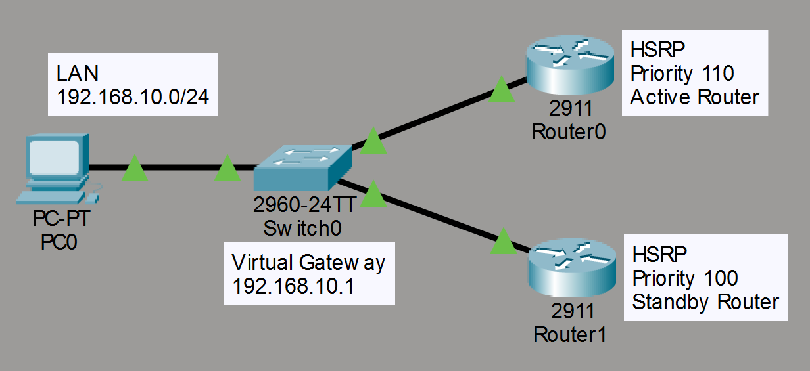
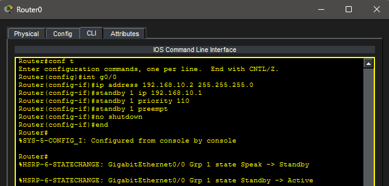
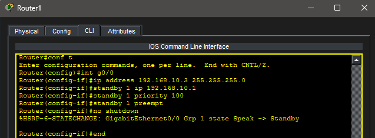
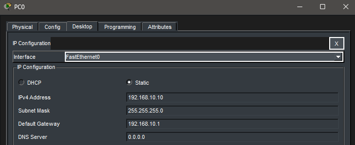
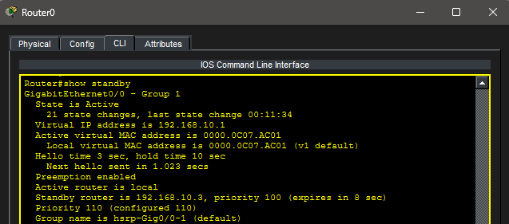
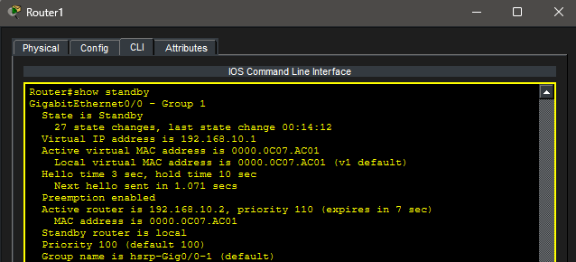
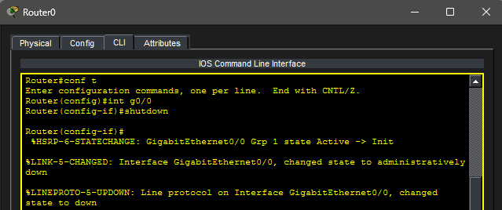
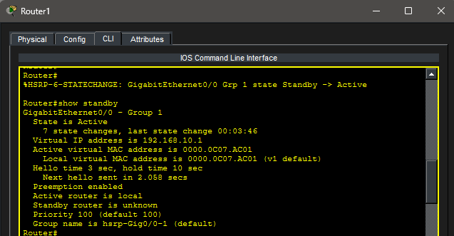
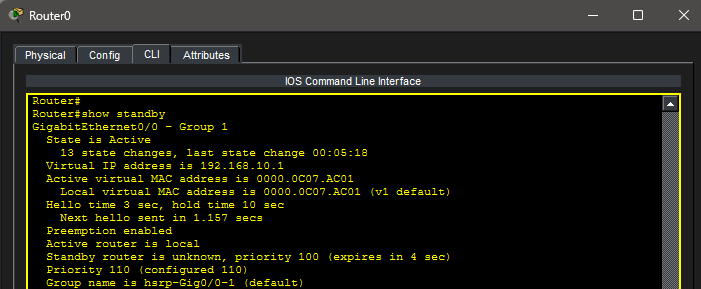
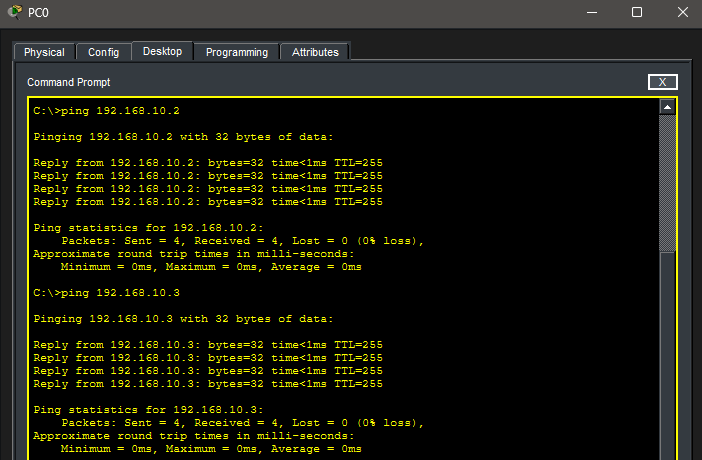

# Lab 21 – HSRP (Hot Standby Router Protocol)

## Objective

Learn how to configure Hot Standby Router Protocol (HSRP) to provide gateway redundancy for a LAN. Configure Active and Standby routers, assign HSRP priorities, enable preemption, simulate a router failure, and verify seamless gateway failover.

---

## Topology

Two routers provide a redundant default gateway for a single LAN using HSRP.



---

## Network Configuration

### LAN Network

- Network: 192.168.10.0/24

### Virtual Gateway

- Virtual IP Address: 192.168.10.1

---

### PC0

- IP Address: 192.168.10.10
- Subnet Mask: 255.255.255.0
- Default Gateway: 192.168.10.1

---

### R0

- Interface: GigabitEthernet0/0
- IP Address: 192.168.10.2
- HSRP Priority: 110
- Role: Active

---

### R1

- Interface: GigabitEthernet0/0
- IP Address: 192.168.10.3
- HSRP Priority: 100
- Role: Standby

---

## Router Configuration

### R0 HSRP Configuration



Configured:

```text
standby 1 ip 192.168.10.1
standby 1 priority 110
standby 1 preempt
```

---

### R1 HSRP Configuration



Configured:

```text
standby 1 ip 192.168.10.1
standby 1 priority 100
standby 1 preempt
```

---

## PC Configuration

### PC0 IP Configuration



---

## HSRP Verification

The HSRP roles were verified on both routers.

### R0 Active State



### R1 Standby State



---

## Failover Test

The Active router interface was shut down to simulate a hardware failure.

### Simulated Router Failure



After the failure, R1 automatically assumed the Active role.

### HSRP Failover



---

## Recovery Test

R0's interface was restored.

Because preemption was enabled and R0 had the higher priority, it automatically reclaimed the Active role.

### R0 Recovery



---

## Connectivity Verification

Connectivity remained available during HSRP operation.

### Successful Connectivity Test



---

## Troubleshooting

### Issue

The primary router was intentionally taken offline.

### Cause

A simulated router failure caused the Active HSRP router to become unavailable.

### Resolution

- The Standby router automatically transitioned to the Active role.
- The primary router was restored.
- Because preemption was enabled, the primary router automatically resumed the Active role.

Verification commands:

```text
show standby
```

---

## Real-World Application

HSRP is widely deployed in enterprise networks to eliminate a single point of failure for the default gateway. By allowing multiple routers to share a virtual IP address, end devices continue communicating even if the primary router fails. This high-availability design minimizes downtime and is commonly implemented in campus networks, data centers, and enterprise branch offices.

---

## Key Takeaways

- HSRP provides default gateway redundancy.
- End devices use a virtual IP address as their default gateway.
- Router priority determines which router becomes Active.
- Higher priority values take precedence.
- Preemption allows the preferred router to automatically reclaim the Active role after recovering.
- HSRP improves network availability by reducing downtime during router failures.

---

## Summary

This lab demonstrated Hot Standby Router Protocol (HSRP) by configuring redundant default gateways using two routers. Active and Standby roles were established, router priorities and preemption were configured, failover was successfully tested, and automatic recovery was verified, demonstrating high availability within an enterprise LAN.
