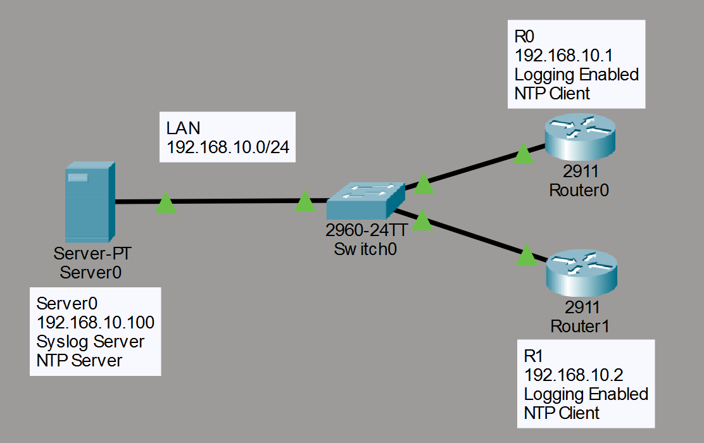
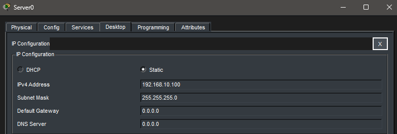
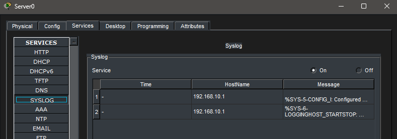
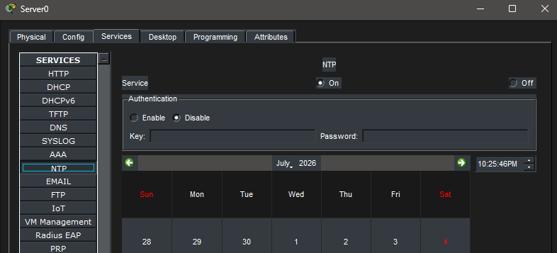
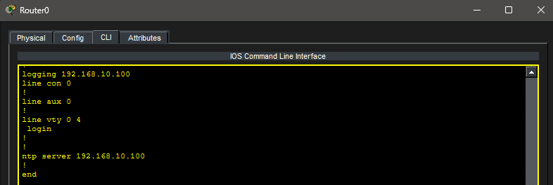
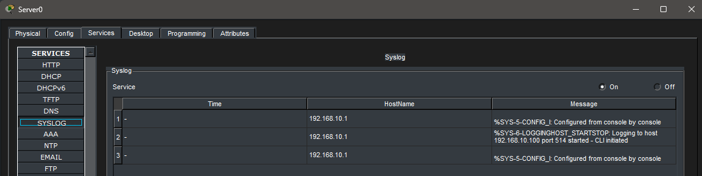
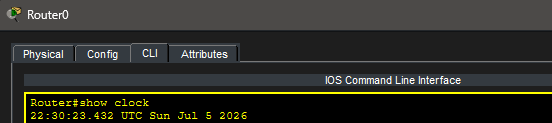
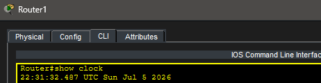

# Lab 22 – Syslog & NTP

## Objective

Learn how to configure centralized Syslog logging and Network Time Protocol (NTP) on Cisco routers. Configure routers to send log messages to a Syslog server, synchronize time using an NTP server, verify the configurations, and understand the importance of centralized logging and accurate timestamps in enterprise networks.

---

## Topology

Two routers communicate with a centralized server providing both Syslog and NTP services.

---

## Network Configuration

### LAN Network

- Network: 192.168.10.0/24

### Server0

- IP Address: 192.168.10.100
- Services:
  - Syslog
  - NTP

---

### R0

- Interface: GigabitEthernet0/0
- IP Address: 192.168.10.1

---

### R1

- Interface: GigabitEthernet0/0
- IP Address: 192.168.10.2

---

## Server Configuration

### Server IP Configuration

---

### Syslog Service

The Syslog service was enabled.

---

### NTP Service

The NTP service was enabled.

---

## Router Configuration

Both routers were configured to:

- Send Syslog messages to the centralized server
- Use the centralized NTP server

### R0 Running Configuration

---

### R1 Running Configuration

---

## Verification

The router configurations were verified using the running configuration.

Both routers successfully contained:

- `logging host 192.168.10.100`
- `ntp server 192.168.10.100`

The Syslog and NTP services were confirmed to be enabled on Server0.

---

### Syslog Messages

Packet Tracer generated Syslog entries confirming communication with the Syslog server.

---

### Router Clocks

### R0 Clock

---

### R1 Clock

---

## Troubleshooting

### Issue

After configuring Syslog and NTP, Packet Tracer did not consistently generate interface state-change Syslog messages or synchronize router clocks.

### Investigation

The following items were verified:

- Both routers contained the correct Syslog configuration.
- Both routers contained the correct NTP server configuration.
- Syslog and NTP services were enabled on Server0.
- Basic Syslog communication between the routers and the server was observed.

### Conclusion

The configuration was verified as correct. The inconsistent Syslog behavior and lack of clock synchronization are limitations of Cisco Packet Tracer rather than configuration errors.

---

## Real-World Application

Enterprise networks rely on centralized logging and synchronized clocks to simplify troubleshooting, security investigations, and performance monitoring. Network administrators commonly deploy Syslog servers to collect log messages from routers, switches, firewalls, and other infrastructure devices. NTP ensures that all devices share a consistent time source so that events can be accurately correlated across multiple systems.

---

## Packet Tracer Notes

Cisco Packet Tracer does not fully emulate every aspect of Syslog and NTP.

Depending on the version of Packet Tracer being used:

- Interface state-change Syslog messages may not be forwarded to the Syslog server.
- Router clocks may not synchronize even when NTP is configured correctly.

These simulator limitations do not affect the configuration process or the networking concepts demonstrated in this lab.

---

## Key Takeaways

- Syslog centralizes network log messages.
- NTP provides a common time source for network devices.
- Accurate timestamps are critical when troubleshooting enterprise networks.
- Router configurations can be verified even when simulator behavior differs from production equipment.
- Packet Tracer does not fully emulate every Cisco IOS feature.

---

## Summary

This lab demonstrated the configuration of centralized Syslog logging and NTP services using Cisco Packet Tracer. Router configurations were successfully verified, server services were enabled, and the limitations of the simulation environment were documented. The lab reinforced the importance of centralized logging and synchronized time within enterprise networks.
