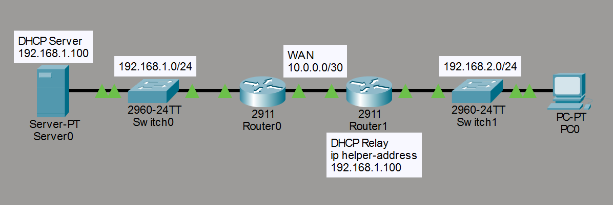
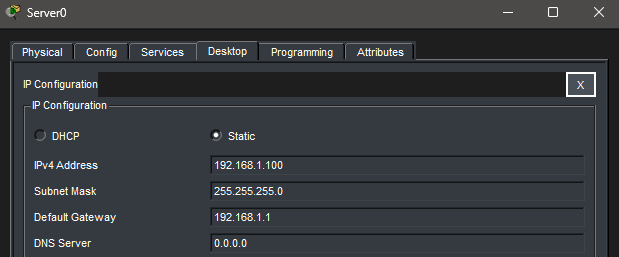
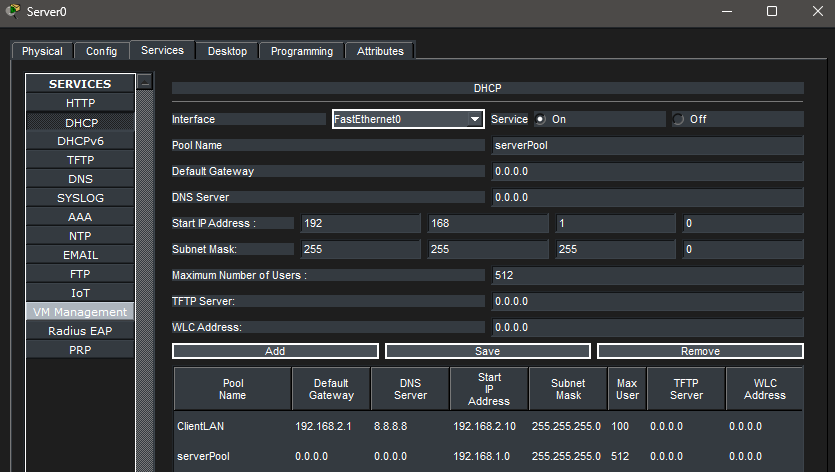
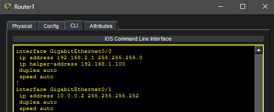
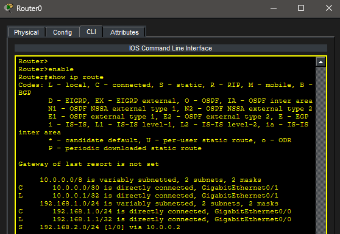
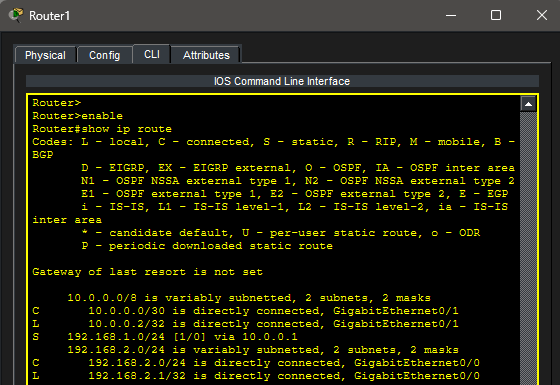
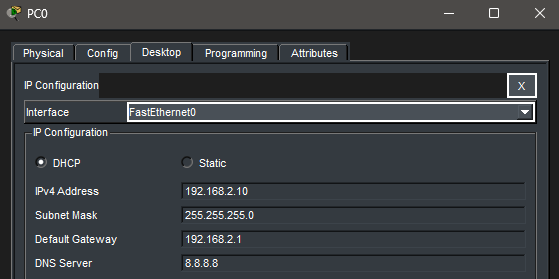
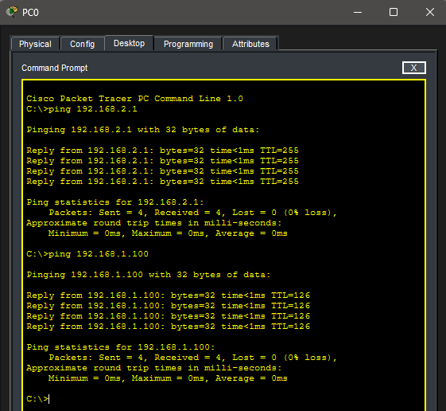

# Lab 23 – DHCP Relay (`ip helper-address`)

## Objective

Learn how to configure DHCP Relay using the `ip helper-address` command. Configure a centralized DHCP server on one subnet, relay DHCP requests across a router, and verify that clients on a remote subnet automatically receive IP configuration.

---

## Topology

A centralized DHCP server provides IP addresses to clients located on a different subnet through a DHCP relay agent.



---

## Network Configuration

### Server LAN

- Network: 192.168.1.0/24

#### Server0

- IP Address: 192.168.1.100
- Default Gateway: 192.168.1.1

#### R0 G0/0

- IP Address: 192.168.1.1

---

### WAN

- Network: 10.0.0.0/30

#### R0 G0/1

- IP Address: 10.0.0.1

#### R1 G0/1

- IP Address: 10.0.0.2

---

### Client LAN

- Network: 192.168.2.0/24

#### R1 G0/0

- IP Address: 192.168.2.1

#### PC0

- Configured using DHCP

---

## Server Configuration

### Server IP Configuration



---

### DHCP Pool Configuration

A DHCP pool was created to provide addresses for the remote client subnet.



Pool Configuration:

- Pool Name: ClientLAN
- Default Gateway: 192.168.2.1
- DNS Server: 8.8.8.8
- Starting IP: 192.168.2.10
- Subnet Mask: 255.255.255.0
- Maximum Users: 100

---

## Router Configuration

Static routes were configured between both routers to provide connectivity between the two LANs.

R1 was configured as the DHCP Relay Agent using:

```text
ip helper-address 192.168.1.100
```

### R1 DHCP Relay Configuration



---

## Routing Verification

### R0 Routing Table



---

### R1 Routing Table



---

## DHCP Verification

PC0 successfully obtained its IP configuration from the centralized DHCP server across the routed network.

### PC0 DHCP Address



---

## Connectivity Verification

Successful end-to-end communication between the client and the DHCP server confirmed proper routing and DHCP relay operation.

### Successful Ping



---

## Troubleshooting

### Problem

PC0 was located on a different subnet than the DHCP server.

### Cause

DHCP Discover messages are broadcasts, and routers do not forward broadcasts by default.

### Resolution

The `ip helper-address` command was configured on R1's client-facing interface.

The router converted the client's DHCP broadcast into a unicast request and forwarded it directly to the DHCP server.

---

## Real-World Application

Enterprise networks commonly use centralized DHCP servers to manage IP address assignment for many different locations. Rather than deploying a DHCP server on every subnet, routers use DHCP Relay (`ip helper-address`) to forward client DHCP requests to a centralized server. This simplifies administration, improves scalability, and reduces infrastructure costs.

---

## Key Takeaways

- DHCP broadcasts do not cross routers by default.
- `ip helper-address` allows routers to forward DHCP requests between subnets.
- DHCP Relay enables centralized IP address management.
- Static routing must exist between the client and DHCP server.
- Centralized DHCP is a common enterprise networking practice.

---

## Summary

This lab demonstrated DHCP Relay by configuring a centralized DHCP server and forwarding DHCP requests across multiple routed networks using the `ip helper-address` command. Successful address assignment and end-to-end connectivity verified correct operation.
