# Lab 24 – Enterprise Integration

## Objective

Integrate multiple CCNA technologies into a single enterprise-style network. This lab combines VLANs, trunking, Router-on-a-Stick, DHCP Relay, OSPF, and ACLs to demonstrate how multiple networking services work together within a realistic environment.

---

## Topology

A small enterprise network consisting of two departments, a centralized DHCP server, dynamic routing, and basic traffic filtering.

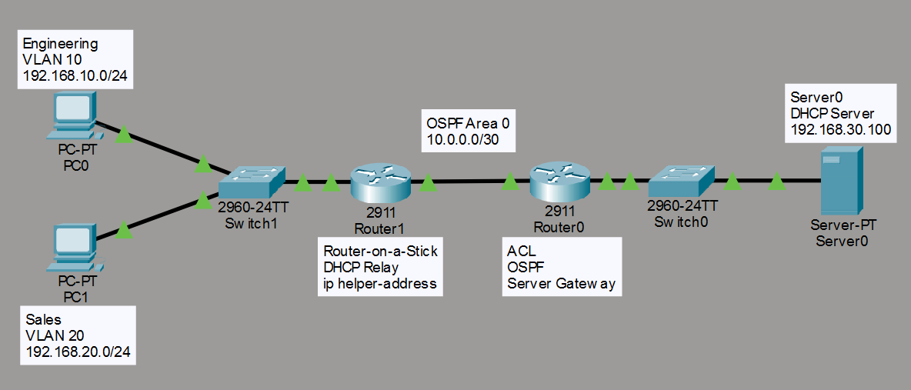

---

## Technologies Implemented

- VLANs
- 802.1Q Trunking
- Router-on-a-Stick
- DHCP Relay (`ip helper-address`)
- OSPF
- Extended ACLs

---

## Network Overview

### VLAN 10 – Engineering

- Network: 192.168.10.0/24

### VLAN 20 – Sales

- Network: 192.168.20.0/24

### Server LAN

- Network: 192.168.30.0/24

### WAN

- Network: 10.0.0.0/30

---

## Switch Configuration

### VLAN Configuration

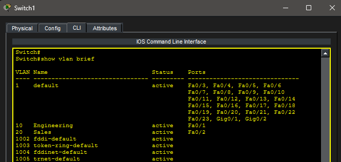

### Trunk Configuration

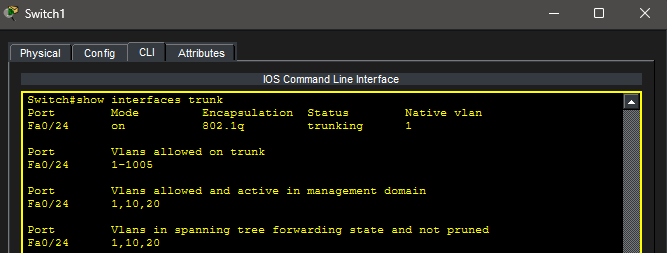

---

## Server Configuration

### IP Configuration

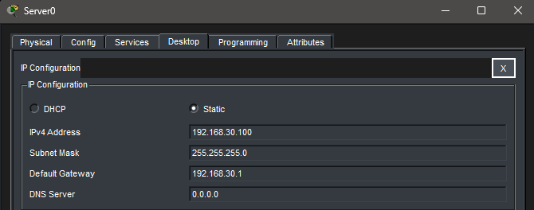

### DHCP Pools

The DHCP server provides addresses for both VLANs.

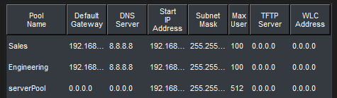

---

## Router Configuration

### Router-on-a-Stick

Subinterfaces were configured for:

- VLAN 10
- VLAN 20

Each VLAN interface was configured with:

- Default gateway
- DHCP Relay (`ip helper-address`)

### DHCP Relay Verification

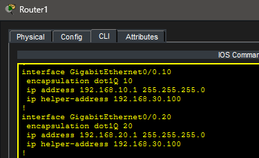

---

## Routing

Dynamic routing was configured using OSPF.

### R0 Routing Table

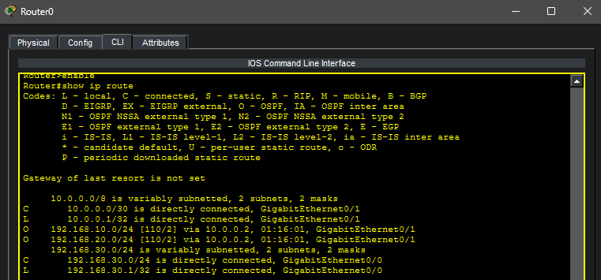

### R1 Routing Table

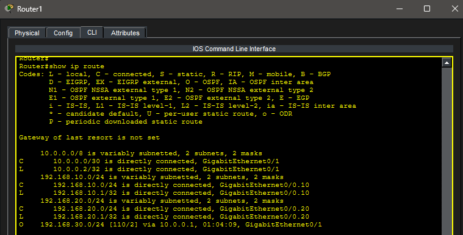

---

## DHCP Verification

### PC0

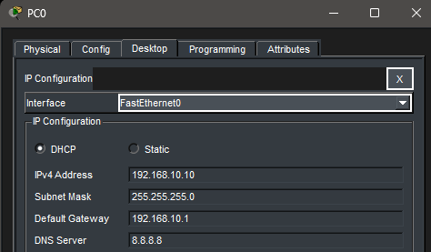

### PC1

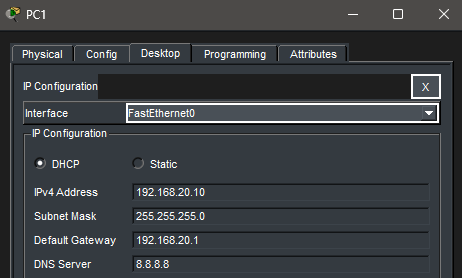

Both clients successfully received addresses from the centralized DHCP server.

---

## ACL Verification

Engineering (VLAN 10) was prevented from accessing the server network while all other traffic remained permitted.

### Failed Server Access

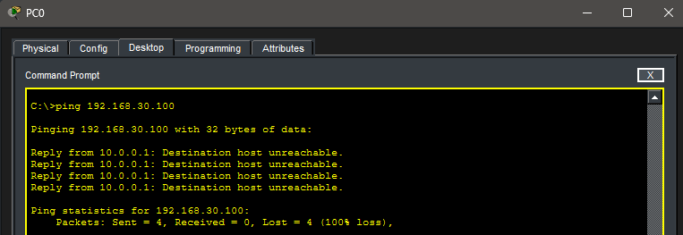

### Successful Server Access

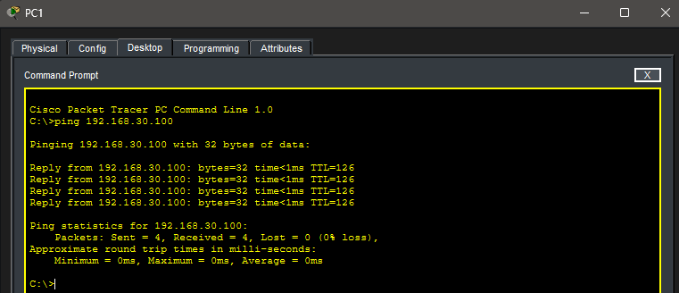

### ACL Hit Counters

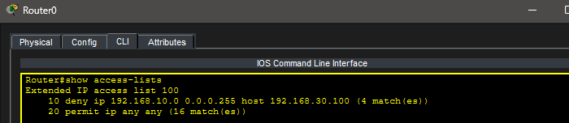

---

## Troubleshooting

During implementation several verification steps were performed:

- Verified VLAN membership
- Verified trunk operation
- Verified Router-on-a-Stick subinterfaces
- Corrected an incorrect OSPF network advertisement
- Corrected ACL application direction
- Verified DHCP Relay operation
- Verified ACL hit counters
- Verified end-to-end routing

---

## Real-World Application

This lab closely resembles a small enterprise deployment. Departments are separated using VLANs, centralized DHCP simplifies address management, OSPF dynamically exchanges routes, and ACLs enforce basic security policies. These technologies are frequently deployed together in production business networks.

---

## Key Takeaways

- Multiple CCNA technologies must work together to build a functional enterprise network.
- DHCP Relay enables centralized IP address management across routed networks.
- OSPF automatically exchanges routing information.
- ACL placement and direction are critical for proper traffic filtering.
- Verifying each network layer independently simplifies troubleshooting.

---

## Summary

This lab integrated several previously learned CCNA technologies into a single enterprise-style network. Successful VLAN segmentation, centralized DHCP, dynamic routing, and traffic filtering demonstrated how enterprise services interact within a routed environment while reinforcing structured troubleshooting techniques.
