# Lab 25 — CCNA Capstone: Redundant Enterprise Network

## Overview

This capstone lab combines the major switching, routing, redundancy, addressing, security, and troubleshooting concepts practiced throughout the CCNA lab series into a single integrated network.

The goal was to design and configure a small enterprise-style network supporting multiple departments while providing:

- VLAN segmentation
- 802.1Q trunking
- Inter-VLAN routing
- First-hop redundancy with HSRP
- Centralized DHCP
- DHCP relay
- Dynamic routing with OSPF
- Extended ACL security
- Gateway failover
- Redundant DHCP relay
- Security-policy persistence during failover
- Failure recovery and verification

Unlike the earlier labs, the completed network was intentionally subjected to a simulated router-side failure to verify that redundancy mechanisms actually worked.

---

## Final Topology

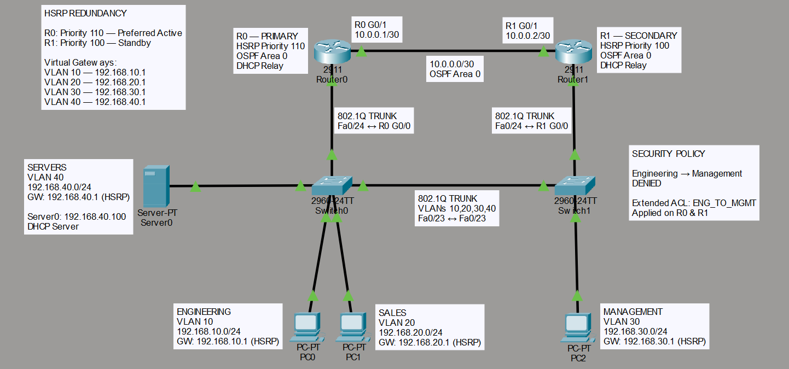

The network contains:

- Two Cisco 2911 routers
- Two Cisco 2960 switches
- Three client PCs
- One centralized DHCP server
- Four VLANs
- Redundant HSRP gateways
- An OSPF transit link between the routers
- Redundant DHCP relay configuration
- An extended ACL protecting the Management network

---

## VLAN and Addressing Plan

| VLAN | Department | Network | HSRP Virtual Gateway |
|---|---|---|---|
| 10 | Engineering | 192.168.10.0/24 | 192.168.10.1 |
| 20 | Sales | 192.168.20.0/24 | 192.168.20.1 |
| 30 | Management | 192.168.30.0/24 | 192.168.30.1 |
| 40 | Servers | 192.168.40.0/24 | 192.168.40.1 |

The client PCs receive their addresses dynamically through DHCP.

Server0 uses the static address:

`192.168.40.100/24`

---

## Router Transit Network

Router0 and Router1 are connected using a dedicated /30 transit network:

| Device | Interface | Address |
|---|---|---|
| Router0 | G0/1 | 10.0.0.1/30 |
| Router1 | G0/1 | 10.0.0.2/30 |

Transit network:

`10.0.0.0/30`

This link participates in OSPF Area 0.

---

# Layer 2 Configuration

## VLANs

Four VLANs were created to logically separate the network by department:

- VLAN 10 — Engineering
- VLAN 20 — Sales
- VLAN 30 — Management
- VLAN 40 — Servers

Access ports were assigned according to the connected endpoint's department.

### VLAN Verification

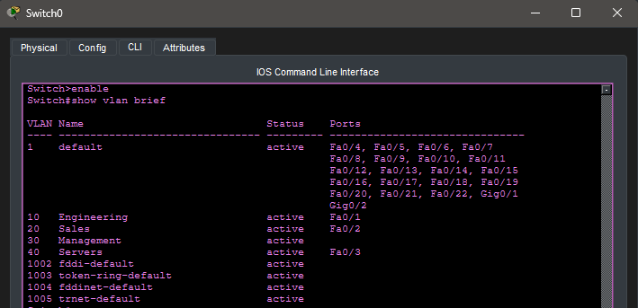

The VLAN table confirms that the required VLANs exist and that the appropriate access ports are assigned.

---

## 802.1Q Trunking

Trunks carry multiple VLANs between the switches and routers.

The topology uses trunk connections for:

- Switch0 ↔ Switch1
- Switch0 ↔ Router0
- Switch1 ↔ Router1

The inter-switch trunk allows VLAN traffic to cross between the two switches.

The router-facing trunks allow the routers to perform inter-VLAN routing using 802.1Q subinterfaces.

### Trunk Verification

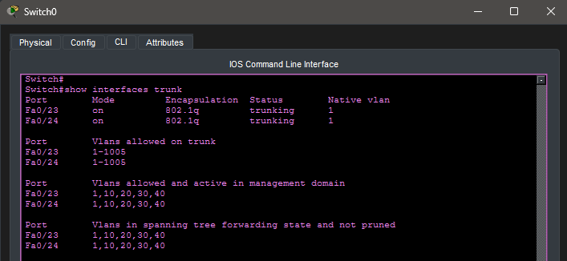

`show interfaces trunk` confirms that the required interfaces are operating as 802.1Q trunks and carrying VLANs 10, 20, 30, and 40.

---

# Inter-VLAN Routing

## Router-on-a-Stick

Router0 and Router1 use subinterfaces corresponding to each VLAN.

Example structure:

```text
G0/0.10 → VLAN 10
G0/0.20 → VLAN 20
G0/0.30 → VLAN 30
G0/0.40 → VLAN 40
```

Each subinterface uses 802.1Q encapsulation for its associated VLAN.

This allows traffic from different VLANs to be routed through the routers while using a single physical router interface.

### Router Interface Verification

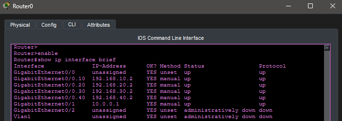

`show ip interface brief` verifies that the physical interfaces and VLAN subinterfaces are operational.

---

# HSRP First-Hop Redundancy

HSRP was configured so client devices do not depend on a single physical router as their default gateway.

Each VLAN uses a virtual gateway:

```text
VLAN 10 → 192.168.10.1
VLAN 20 → 192.168.20.1
VLAN 30 → 192.168.30.1
VLAN 40 → 192.168.40.1
```

Router0 is the preferred Active router:

```text
Priority: 110
Preempt: Enabled
```

Router1 uses priority 100 and normally operates as the Standby router.

If Router0 becomes unavailable, Router1 assumes ownership of the HSRP virtual gateways without requiring any gateway changes on the clients.

When Router0 returns, preemption allows the higher-priority Router0 to reclaim the Active role.

### Normal HSRP State — Router0

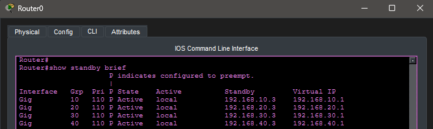

Router0 is normally Active for the HSRP groups.

### Normal HSRP State — Router1

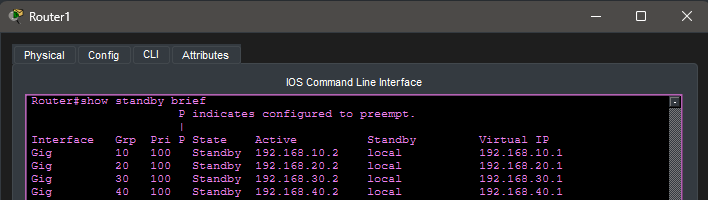

Router1 remains available as the Standby gateway during normal operation.

---

# Centralized DHCP

Server0 provides centralized DHCP services from the Servers VLAN.

Static server address:

`192.168.40.100`

Separate DHCP pools provide addressing information for the client VLANs.

The pools provide clients with:

- IPv4 address
- Subnet mask
- HSRP virtual default gateway

### DHCP Server Configuration

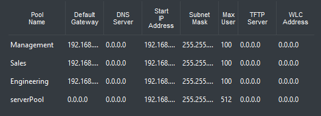

---

# DHCP Relay

DHCP Discover messages are broadcasts and normally cannot cross a router.

Because the DHCP server resides in VLAN 40 while clients exist in other VLANs, the routers use DHCP relay.

The client-facing router subinterfaces use:

```text
ip helper-address 192.168.40.100
```

The helper address converts and forwards the client DHCP request toward the centralized DHCP server.

The relay configuration exists on both routers so DHCP continues to operate if Router0 becomes unavailable.

### DHCP Client Verification

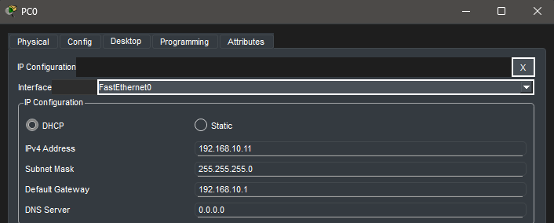

PC0 successfully receives its Engineering VLAN configuration dynamically and uses the HSRP virtual IP as its default gateway.

---

# OSPF Dynamic Routing

Router0 and Router1 participate in OSPF Process 1 using Area 0.

The router-to-router transit network is:

`10.0.0.0/30`

OSPF was also configured for the VLAN networks.

The client-facing VLAN subinterfaces were configured as passive interfaces so the networks can participate in OSPF without sending unnecessary OSPF Hello packets toward end devices.

### OSPF Neighbor Verification

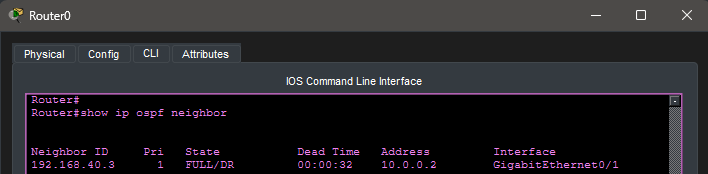

`show ip ospf neighbor` confirms that Router0 and Router1 successfully form a FULL OSPF adjacency.

---

# Extended ACL Security

An extended named ACL was created to enforce the following security policy:

> Engineering devices must not be allowed to communicate with the Management network.

ACL name:

`ENG_TO_MGMT`

Policy:

```text
Source:
192.168.10.0/24 — Engineering

Destination:
192.168.30.0/24 — Management

Action:
DENY
```

Other IP traffic is permitted.

Conceptually:

```text
Engineering → Management    DENIED
Engineering → Sales         PERMITTED
Engineering → Servers       PERMITTED
```

The ACL is applied inbound near the Engineering source.

Because either router can become the HSRP Active gateway, the ACL was configured on both Router0 and Router1.

This prevents the security policy from disappearing during gateway failover.

### ACL Verification

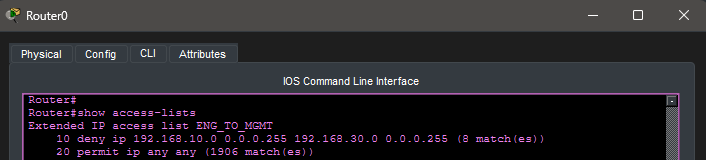

ACL hit counters confirm that traffic matched the configured rules.

---

# Connectivity Verification

## Permitted Traffic

Engineering was verified to retain access to permitted destinations.

PC0 successfully reached Server0:

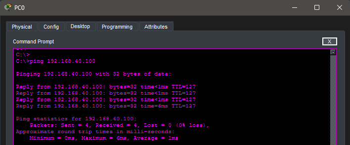

This verifies that the ACL does not unnecessarily block other Engineering traffic.

---

## Blocked Traffic

PC0 attempted to reach the Management VLAN.

The traffic was successfully denied:

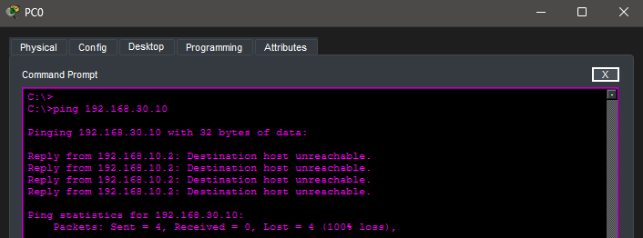

This verifies that the Engineering-to-Management security policy operates as intended.

---

# Failure Testing

After the network was fully configured and verified under normal conditions, Router0's LAN-facing physical interface was intentionally shut down.

This simulated the loss of the preferred HSRP router's connection to the LAN.

The test was used to verify:

1. HSRP gateway failover
2. Continued client connectivity
3. ACL enforcement through the secondary router
4. DHCP relay through the secondary router
5. HSRP preemption after Router0 recovery

---

## HSRP Failover

Before the failure:

```text
Router0 → Active
Router1 → Standby
```

Router0's G0/0 interface was then shut down.

Router1 detected the loss of the Active router and assumed the Active HSRP role.

### Router1 Active During Failure

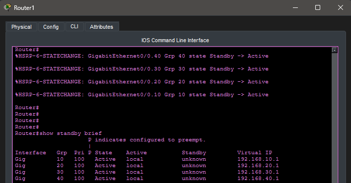

Client default gateways did not need to change.

For example, Engineering continued using:

`192.168.10.1`

The virtual IP remained the same even though Router1 had taken responsibility for forwarding the traffic.

This demonstrates the primary purpose of first-hop redundancy.

---

# Security Policy During Failover

After Router1 became Active, Engineering again attempted to reach Management.

The traffic remained blocked.

### Router1 ACL During Failover

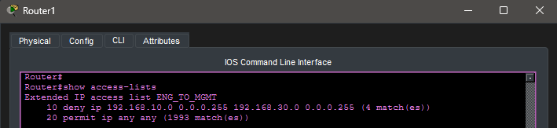

The ACL hit counter on Router1 confirmed that the secondary router was actively enforcing the same security policy.

This demonstrates that network redundancy must include configuration and security-policy redundancy, not just redundant hardware.

---

# DHCP During Failover

While Router0 remained unavailable, PC0 was forced to request a new DHCP lease.

Router1 successfully relayed the DHCP request to Server0 using its configured helper address.

PC0 received a valid Engineering address and retained the HSRP virtual gateway.

This verified that centralized DHCP continued to function even when the preferred HSRP router was unavailable.

---

# Router0 Recovery and HSRP Preemption

Router0's G0/0 interface was restored using:

```text
no shutdown
```

After Router0 returned, HSRP preemption allowed the higher-priority Router0 to reclaim the Active role.

The final state returned to:

```text
Router0 → Active
Router1 → Standby
```

This verified both automatic failover and automatic recovery of the preferred gateway.

---

# Final Verification

After restoring Router0, the network was returned to its normal healthy state.

The following were verified:

- Router interfaces and subinterfaces were up/up
- Router0 was HSRP Active
- Router1 was HSRP Standby
- OSPF neighbor state was FULL
- VLANs remained correctly configured
- 802.1Q trunks remained operational
- DHCP clients received valid addressing
- DHCP relay remained operational
- Engineering could reach permitted networks
- Engineering remained blocked from Management
- ACL hit counters confirmed policy enforcement
- HSRP successfully failed over to Router1
- DHCP continued working during Router0 failure
- ACL security continued working during Router0 failure
- Router0 reclaimed the Active role after recovery

---

# Key Concepts Reinforced

This capstone reinforced concepts practiced throughout the CCNA lab series:

- IPv4 addressing and subnetting
- VLAN creation and assignment
- Access ports
- 802.1Q trunking
- Router-on-a-Stick
- Inter-VLAN routing
- DHCP
- DHCP relay
- HSRP
- HSRP priority
- HSRP preemption
- OSPF
- OSPF Area 0
- OSPF neighbor adjacency
- Passive OSPF interfaces
- Standard network verification commands
- Extended ACLs
- ACL placement
- Wildcard masks
- ACL hit counters
- Redundancy
- Failure testing
- Layered troubleshooting

---

# Troubleshooting and Validation Approach

The network was built and validated incrementally rather than configuring every technology at once.

Each layer was verified before progressing to the next:

```text
Physical Connectivity
        ↓
VLANs
        ↓
802.1Q Trunks
        ↓
Inter-VLAN Routing
        ↓
HSRP
        ↓
DHCP / DHCP Relay
        ↓
OSPF
        ↓
ACL Security
        ↓
Failure Testing
        ↓
Final Verification
```

This approach made it possible to isolate configuration problems instead of troubleshooting the entire network simultaneously.

Verification commands included:

```text
show vlan brief
show interfaces trunk
show ip interface brief
show standby brief
show ip ospf neighbor
show ip protocols
show access-lists
ping
ipconfig
```

---

# Conclusion

Lab 25 serves as the capstone of the CCNA Packet Tracer lab series.

Rather than demonstrating a single technology, the lab required multiple networking technologies to operate together as one system.

The completed network provides:

- Departmental segmentation
- Inter-VLAN communication
- Dynamic client addressing
- Centralized DHCP services
- Dynamic routing
- Redundant default gateways
- Redundant DHCP relay
- Traffic filtering
- Security-policy redundancy
- Automatic gateway failover and recovery

Most importantly, the network was not considered complete simply because the configuration appeared correct.

The design was intentionally subjected to a simulated failure and tested to confirm that connectivity, DHCP services, gateway redundancy, and security policies continued functioning as intended.

This lab represents the culmination of the concepts practiced throughout the 25-lab CCNA portfolio.
